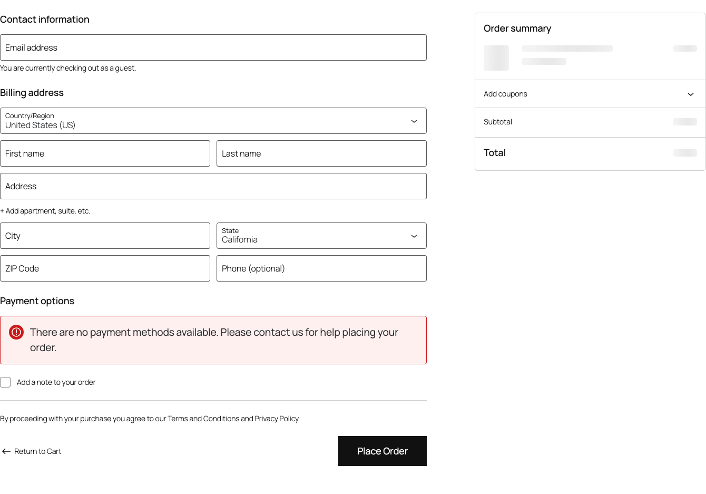

Przed złożeniem zamówienia klient musi zaakceptować regulamin i politykę prywatności. Wtyczka Polski for WooCommerce dodaje checkboxy prawne z konfiguracją treści, walidacją i komunikatami błędów.

## Wymagania prawne

Sklep musi uzyskać wyraźną zgodę klienta na:

- regulamin sklepu (warunki umowy sprzedaży)
- politykę prywatności (przetwarzanie danych osobowych)
- prawo do odstąpienia od umowy (informacja o 14-dniowym terminie)

Każda zgoda wymaga osobnego checkboxa. Checkbox nie może być domyślnie zaznaczony.



## Konfiguracja

Przejdź do **WooCommerce > Ustawienia > Polski > Kasa** i skonfiguruj sekcję "Checkboxy prawne".

### Domyślne checkboxy

Wtyczka dodaje te checkboxy:

| Checkbox | Wymagany | Domyślna treść |
|----------|----------|----------------|
| Regulamin | Tak | Zapoznałem się z [regulaminem] i akceptuję jego postanowienia. |
| Polityka prywatności | Tak | Zapoznałem się z [polityką prywatności] i wyrażam zgodę na przetwarzanie moich danych osobowych. |
| Prawo odstąpienia | Tak | Zostałem poinformowany o prawie do odstąpienia od umowy w terminie 14 dni. |
| Zgoda marketingowa | Nie | Wyrażam zgodę na otrzymywanie informacji handlowych drogą elektroniczną. |

### Dodawanie niestandardowego checkboxa

W panelu konfiguracji kliknij **Dodaj checkbox** i wypełnij formularz:

| Pole | Opis |
|------|------|
| Nazwa | Wewnętrzny identyfikator (np. `newsletter_consent`) |
| Etykieta | Tekst wyświetlany obok checkboxa |
| Wymagany | Czy checkbox musi być zaznaczony do złożenia zamówienia |
| Pozycja | Kolejność wyświetlania (liczba) |
| Opis | Dodatkowy tekst pod checkboxem (opcjonalny) |
| Komunikat błędu | Tekst wyświetlany, gdy wymagany checkbox nie jest zaznaczony |

### Formatowanie etykiet

W treści etykiety możesz używać:

- `[regulamin]` - automatyczny link do strony regulaminu
- `[polityka-prywatnosci]` - automatyczny link do polityki prywatności
- `[odstapienie]` - link do strony o prawie odstąpienia
- `<a href="URL">tekst</a>` - niestandardowy link
- `<strong>tekst</strong>` - pogrubienie

Strony regulaminu i polityki prywatności pobierają się z **WooCommerce > Ustawienia > Zaawansowane > Konfiguracja strony**.

## Walidacja

### Walidacja po stronie serwera

Wtyczka sprawdza checkboxy po stronie serwera hookiem `woocommerce_checkout_process`. Jeśli wymagany checkbox nie jest zaznaczony, zamówienie nie przejdzie i klient zobaczy błąd.

### Walidacja po stronie klienta

Opcjonalna walidacja JavaScript pokazuje błąd od razu po kliknięciu przycisku, bez przeładowania strony. Włącz ją w:

**WooCommerce > Ustawienia > Polski > Kasa > Walidacja JS checkboxów**

### Komunikaty błędów

Każdy checkbox ma konfigurowalny komunikat błędu. Domyślne komunikaty:

| Checkbox | Komunikat błędu |
|----------|----------------|
| Regulamin | Aby złożyć zamówienie, musisz zaakceptować regulamin sklepu. |
| Polityka prywatności | Aby złożyć zamówienie, musisz zaakceptować politykę prywatności. |
| Prawo odstąpienia | Musisz potwierdzić zapoznanie się z informacją o prawie odstąpienia. |

## Przechowywanie zgód

Wtyczka zapisuje informacje o zgodach:

- jako metadane zamówienia (`_polski_consent_*`)
- z datą i godziną udzielenia zgody
- z wersją regulaminu/polityki prywatności (jeśli włączone śledzenie wersji)

Te dane widać w panelu admina zamówienia. Można je wyeksportować na potrzeby RODO.

### Podgląd zgód w zamówieniu

W widoku zamówienia w panelu administracyjnym, w sekcji "Zgody prawne", znajdziesz listę udzielonych zgód z datami.

## Programistyczne zarządzanie checkboxami

### Dodawanie checkboxa programistycznie

```php
add_filter('polski/checkout/legal_checkboxes', function (array $checkboxes): array {
    $checkboxes['custom_consent'] = [
        'label'         => 'Wyrażam zgodę na przetwarzanie danych w celu realizacji reklamacji.',
        'required'      => true,
        'position'      => 50,
        'error_message' => 'Musisz wyrazić zgodę na przetwarzanie danych.',
        'description'   => '',
    ];

    return $checkboxes;
});
```

### Usuwanie checkboxa

```php
add_filter('polski/checkout/legal_checkboxes', function (array $checkboxes): array {
    unset($checkboxes['marketing_consent']);

    return $checkboxes;
});
```

### Modyfikacja istniejącego checkboxa

```php
add_filter('polski/checkout/legal_checkboxes', function (array $checkboxes): array {
    if (isset($checkboxes['terms'])) {
        $checkboxes['terms']['label'] = 'Akceptuję <a href="/regulamin">regulamin</a> sklepu.';
    }

    return $checkboxes;
});
```

### Warunkowe wyświetlanie checkboxa

```php
add_filter('polski/checkout/legal_checkboxes', function (array $checkboxes): array {
    $cart_total = WC()->cart->get_total('edit');

    if ($cart_total > 500) {
        $checkboxes['high_value_consent'] = [
            'label'         => 'Potwierdzam zamówienie o wartości powyżej 500 zł.',
            'required'      => true,
            'position'      => 60,
            'error_message' => 'Musisz potwierdzić zamówienie o wysokiej wartości.',
        ];
    }

    return $checkboxes;
});
```

## Stylowanie CSS

```css
.polski-legal-checkboxes {
    margin: 1.5em 0;
    padding: 1em;
    background: #f9f9f9;
    border: 1px solid #e0e0e0;
    border-radius: 4px;
}

.polski-legal-checkbox {
    margin-bottom: 0.8em;
}

.polski-legal-checkbox label {
    font-size: 0.9em;
    line-height: 1.5;
    cursor: pointer;
}

.polski-legal-checkbox__description {
    margin-top: 0.3em;
    font-size: 0.8em;
    color: #666;
}

.polski-legal-checkbox--error label {
    color: #c00;
}
```

## Kompatybilność z Block Checkout

Wtyczka obsługuje checkboxy w klasycznym checkout i Block Checkout. W Block Checkout checkboxy działają przez blok `woocommerce/checkout-terms-block`.

## Najczęstsze problemy

### Checkboxy nie wyświetlają się

1. Sprawdź, czy moduł jest włączony w ustawieniach
2. Upewnij się, że strony regulaminu i polityki prywatności są ustawione w WooCommerce
3. Zweryfikuj, czy inna wtyczka nie usuwa checkboxów

### Link w etykiecie nie działa

Sprawdź, czy strona docelowa jest opublikowana (nie w wersji roboczej) i czy skrót (np. `[regulamin]`) jest poprawnie wpisany.

### Zamówienie przechodzi mimo niezaznaczonego checkboxa

Sprawdź, czy checkbox jest oznaczony jako "Wymagany". Zweryfikuj konsolę przeglądarki pod kątem błędów JavaScript, które mogą blokować walidację po stronie klienta.

## Powiązane zasoby

- [Zgłoś problem](https://github.com/wppoland/polski/issues)

<div class="disclaimer">Ta strona ma wyłącznie charakter informacyjny i nie stanowi porady prawnej. Przed wdrożeniem skonsultuj się z prawnikiem. Polski for WooCommerce jest oprogramowaniem open source (GPLv2) dostarczanym bez gwarancji.</div>
