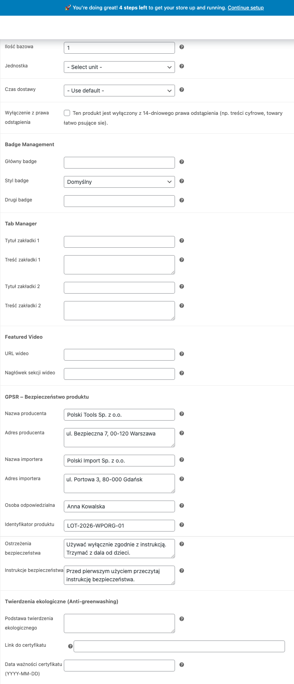

Rozporządzenie GPSR (General Product Safety Regulation, EU 2023/988) obowiązuje od 13 grudnia 2024 roku. Nakłada na sprzedawców obowiązek podawania szczegółowych informacji o bezpieczeństwie produktów sprzedawanych na terenie Unii Europejskiej. Polski for WooCommerce dostarcza kompletny zestaw pól produktowych, kolumnę statusu oraz narzędzia importu/eksportu CSV, które pozwalają spełnić te wymagania bez dodatkowych wtyczek.

## Wymagania GPSR

Każdy produkt niespożywczy sprzedawany w UE musi zawierać:

1. **Dane producenta** - nazwa, adres, dane kontaktowe
2. **Dane importera** - jeśli producent ma siedzibę poza UE
3. **Osoba odpowiedzialna w UE** - wymagana dla produktów spoza UE
4. **Identyfikatory produktu** - numer partii, numer seryjny, kod EAN/GTIN
5. **Ostrzeżenia** - informacje o zagrożeniach i ograniczeniach wiekowych
6. **Instrukcje bezpieczeństwa** - zasady bezpiecznego użytkowania
7. **Zdjęcia/dokumenty** - opcjonalne załączniki (karty charakterystyki, certyfikaty)
8. **Kategoria ryzyka** - klasyfikacja poziomu ryzyka produktu

## Konfiguracja pól GPSR

Pola GPSR znajdziesz w edycji produktu WooCommerce, w zakładce **Polski - GPSR**. Każde pole jest opcjonalne, ale rozporządzenie wymaga wypełnienia wszystkich mających zastosowanie do danego produktu.



### Producent

Wypełnij pełne dane producenta:

- Nazwa firmy
- Adres (ulica, kod pocztowy, miasto, kraj)
- Adres e-mail
- Numer telefonu
- Strona internetowa

### Importer

Pole wymagane, gdy producent ma siedzibę poza Unią Europejską. Podaj te same kategorie danych co w przypadku producenta.

### Osoba odpowiedzialna w UE

Od 13 grudnia 2024 roku każdy produkt niespożywczy sprzedawany w UE przez podmiot spoza UE musi mieć wyznaczoną osobę odpowiedzialną z siedzibą w Unii. Podaj:

- Nazwa firmy lub imię i nazwisko
- Adres w UE
- Dane kontaktowe (e-mail, telefon)

### Identyfikatory produktu

- **Numer partii (LOT)** - identyfikator partii produkcyjnej
- **Numer seryjny** - unikalny identyfikator egzemplarza
- **EAN/GTIN** - kod kreskowy produktu
- **Numer modelu** - oznaczenie modelu

### Ostrzeżenia i ograniczenia

Pole tekstowe na informacje o:

- Zagrożeniach związanych z użytkowaniem
- Ograniczeniach wiekowych (np. "Nieodpowiednie dla dzieci poniżej 3 lat")
- Wymaganiach dotyczących nadzoru osoby dorosłej
- Substancjach niebezpiecznych

### Instrukcje bezpieczeństwa

Pole na instrukcje dotyczące:

- Prawidłowego montażu i instalacji
- Bezpiecznego użytkowania
- Konserwacji i przechowywania
- Postępowania w razie wypadku

## Kolumna statusu GPSR

Na liście produktów w panelu administracyjnym (**Produkty > Wszystkie produkty**) wtyczka dodaje kolumnę **GPSR**, która wyświetla status wypełnienia pól:

- Zielona ikona - wszystkie wymagane pola wypełnione
- Pomarańczowa ikona - częściowo wypełnione
- Czerwona ikona - brak danych GPSR

Kolumna umożliwia szybką identyfikację produktów wymagających uzupełnienia danych przed wejściem regulacji w życie.

## Import i eksport CSV

### Eksport

Podczas eksportu produktów WooCommerce (**Produkty > Eksportuj**) wtyczka automatycznie dodaje kolumny GPSR do pliku CSV:

- `gpsr_manufacturer_name`
- `gpsr_manufacturer_address`
- `gpsr_manufacturer_email`
- `gpsr_manufacturer_phone`
- `gpsr_manufacturer_url`
- `gpsr_importer_name`
- `gpsr_importer_address`
- `gpsr_importer_email`
- `gpsr_eu_responsible_name`
- `gpsr_eu_responsible_address`
- `gpsr_eu_responsible_email`
- `gpsr_identifiers_lot`
- `gpsr_identifiers_serial`
- `gpsr_identifiers_ean`
- `gpsr_identifiers_model`
- `gpsr_warnings`
- `gpsr_instructions`

### Import

Przygotuj plik CSV z odpowiednimi nagłówkami kolumn (identycznymi jak przy eksporcie). Import odbywa się standardową ścieżką WooCommerce: **Produkty > Importuj**.

Wskazówka: wyeksportuj najpierw kilka produktów, aby uzyskać szablon CSV z prawidłowymi nagłówkami.

## Shortcode

Użyj shortcode `[polski_gpsr]` do wyświetlenia informacji GPSR na stronie produktu lub w dowolnym miejscu witryny.

### Podstawowe użycie

```
[polski_gpsr]
```

Wyświetla dane GPSR bieżącego produktu (działa na stronie produktu WooCommerce).

### Z określeniem produktu

```
[polski_gpsr product_id="123"]
```

Wyświetla dane GPSR dla produktu o podanym ID.

### Przykład wyniku

Shortcode generuje sformatowaną tabelę z sekcjami:

| Sekcja | Zawartość |
|--------|-----------|
| Producent | Nazwa, adres, e-mail, telefon, strona www |
| Importer | Nazwa, adres, e-mail (jeśli dotyczy) |
| Osoba odpowiedzialna w UE | Nazwa, adres, dane kontaktowe |
| Identyfikatory | LOT, numer seryjny, EAN, model |
| Ostrzeżenia | Tekst ostrzeżeń |
| Instrukcje | Tekst instrukcji bezpieczeństwa |

## Masowe uzupełnianie danych

Jeśli wiele produktów pochodzi od tego samego producenta, najefektywniejszym sposobem jest:

1. Wyeksportuj produkty do CSV
2. Wypełnij kolumny producenta dla wszystkich wierszy (kopiuj-wklej w arkuszu kalkulacyjnym)
3. Zaimportuj zaktualizowany plik CSV

## Rozwiązywanie problemów

**Pola GPSR nie pojawiają się w edycji produktu**
Upewnij się, że moduł GPSR jest włączony w ustawieniach wtyczki: **WooCommerce > Ustawienia > Polski > Moduły**.

**Kolumna statusu nie wyświetla się na liście produktów**
Kliknij przycisk "Opcje ekranu" w prawym górnym rogu strony z listą produktów i zaznacz kolumnę GPSR.

**Dane nie importują się z CSV**
Sprawdź, czy nagłówki kolumn w pliku CSV dokładnie odpowiadają formatowi eksportu. Nazwy kolumn są wrażliwe na wielkość liter.

## Dalsze kroki

- Zgłaszaj problemy: [GitHub Issues](https://github.com/wppoland/polski/issues)
- Dyskusje i pytania: [GitHub Discussions](https://github.com/wppoland/polski/discussions)

<div class="disclaimer">Ta strona ma wyłącznie charakter informacyjny i nie stanowi porady prawnej. Przed wdrożeniem skonsultuj się z prawnikiem. Polski for WooCommerce jest oprogramowaniem open source (GPLv2) dostarczanym bez gwarancji.</div>
