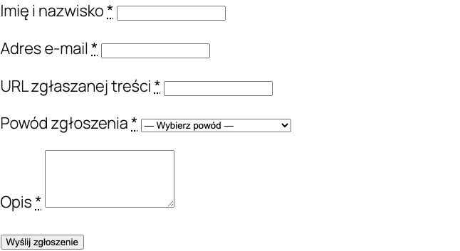

Akt o digitálních službách (Digital Services Act, EU 2022/2065) vyžaduje, aby online platformy umožňovaly nahlašovat nezákonný obsah. Plugin přidává formulář pro nahlášení, panel pro správu hlášení, sledování stavů a automatická e-mailová upozornění.

## Požadavky DSA pro internetové obchody

Od 17. února 2024 musí obchody s uživatelským obsahem (recenze, komentáře, fotografie):

1. Zpřístupnit mechanismus pro nahlašování nezákonného obsahu
2. Potvrdit přijetí hlášení
3. Vyřídit hlášení v přiměřené lhůtě
4. Informovat oznamovatele o rozhodnutí
5. Umožnit odvolání proti rozhodnutí

Týká se obchodů, v nichž uživatelé mohou zveřejňovat obsah, především recenze produktů.

## Formulář pro nahlášení

### Shortcode

Vložte formulář pro nahlášení DSA na libovolnou stránku pomocí shortcode:

```
[polski_dsa_report]
```

### S parametry

```
[polski_dsa_report product_id="123" category="illegal_content"]
```

### Parametry shortcode

| Parametr | Popis | Výchozí hodnota |
|----------|------|------------------|
| `product_id` | ID produktu, kterého se hlášení týká | Žádné (vybírá uživatel) |
| `category` | Předem vybraná kategorie hlášení | Žádné |



### Pole formuláře

Formulář obsahuje následující pole:

- **Kategorie hlášení** - výběr ze seznamu (nezákonný obsah, porušení autorských práv, falešná recenze, nenávistné projevy, osobní údaje, jiné)
- **URL nebo identifikátor obsahu** - odkaz na nahlašovaný obsah nebo ID recenze
- **Popis** - podrobný popis problému
- **Právní základ** - volitelné uvedení předpisu
- **Kontaktní údaje** - jméno, e-mailová adresa oznamovatele
- **Prohlášení** - zaškrtávací políčko potvrzující, že hlášení je podáno v dobré víře

### Příklad vložení

Vytvořte stránku "Nahlásit obsah" a přidejte shortcode:

```
[polski_dsa_report]
```

Přidejte odkaz na tuto stránku do patičky obchodu, aby byla snadno dostupná.

## Administrační panel

Hlášení DSA spravujete v **WooCommerce > Hlášení DSA**.

### Seznam hlášení

Seznam zobrazuje všechna hlášení se sloupci:

- ID hlášení
- Datum podání
- Kategorie
- Stav (nové, probíhá, vyřízeno, odmítnuto)
- Oznamovatel (jméno, e-mail)
- Odkaz na obsah

### Detail hlášení

Po kliknutí na hlášení uvidíte:

- Kompletní data formuláře
- Náhled nahlašovaného obsahu (pokud jde o recenzi, přímý odkaz)
- Historii změn stavu
- Pole pro interní poznámku
- Tlačítka akcí (změnit stav, odstranit obsah, odmítnout)

### Stavy hlášení

| Stav | Popis |
|--------|------|
| `new` | Nové hlášení, čeká na vyřízení |
| `in_progress` | Hlášení v procesu analýzy |
| `resolved` | Hlášení vyřízeno, obsah odstraněn nebo provedena jiná akce |
| `rejected` | Hlášení odmítnuto jako neopodstatněné |
| `appealed` | Oznamovatel podal odvolání proti rozhodnutí |

## E-mailová upozornění

Plugin odesílá automatické e-maily v těchto situacích:

| Událost | Příjemce | Obsah |
|-----------|----------|-------|
| Nové hlášení | Administrátor | Informace o novém hlášení s údaji |
| Potvrzení | Oznamovatel | Potvrzení přijetí hlášení s číslem ID |
| Změna stavu | Oznamovatel | Informace o změně stavu s odůvodněním |
| Vyřízení | Oznamovatel | Rozhodnutí s odůvodněním a informací o právu na odvolání |

Šablony e-mailů lze přizpůsobit v **WooCommerce > Nastavení > E-maily**.

## Hook

### polski/dsa/report_created

Vyvolán po vytvoření nového hlášení DSA.

```php
/**
 * @param int    $report_id   ID zgłoszenia DSA.
 * @param array  $report_data Dane zgłoszenia.
 * @param string $category    Kategoria zgłoszenia.
 */
add_action('polski/dsa/report_created', function (int $report_id, array $report_data, string $category): void {
    // Przykład: wyślij powiadomienie do zespołu prawnego przez Slack
    $webhook_url = 'https://hooks.slack.com/services/XXXX/YYYY/ZZZZ';
    
    wp_remote_post($webhook_url, [
        'body' => wp_json_encode([
            'text' => sprintf(
                'Nowe zgłoszenie DSA #%d (kategoria: %s) - %s',
                $report_id,
                $category,
                $report_data['description']
            ),
        ]),
        'headers' => ['Content-Type' => 'application/json'],
    ]);
}, 10, 3);
```

### Příklad - automatické odstranění recenze určité kategorie

```php
add_action('polski/dsa/report_created', function (int $report_id, array $report_data, string $category): void {
    // Automatycznie ukryj recenzje zgłoszone jako mowa nienawiści
    if ($category !== 'hate_speech') {
        return;
    }
    
    $comment_id = $report_data['content_id'] ?? 0;
    if ($comment_id > 0) {
        wp_set_comment_status($comment_id, 'hold');
        
        // Zaloguj automatyczną akcję
        update_post_meta($report_id, '_auto_action', 'comment_held');
    }
}, 10, 3);
```

## Reportování

DSA vyžaduje vedení registru hlášení. Exportujte všechna hlášení do CSV přes **WooCommerce > Hlášení DSA > Exportovat**. Export obsahuje:

- ID hlášení
- Datum a čas podání
- Kategorii
- Stav a datum vyřízení
- Dobu zpracování (v hodinách)
- Provedenou akci

## Konfigurace

Nastavení modulu DSA najdete v **WooCommerce > Nastavení > Polski > DSA**.

| Možnost | Popis | Výchozí hodnota |
|-------|------|------------------|
| Zapnout formulář DSA | Aktivuje modul | Ano |
| Stránka formuláře | Stránka WordPress se shortcode | Žádná |
| E-mail administrátora | E-mailová adresa pro upozornění | E-mail administrátora WordPress |
| Lhůta pro vyřízení | Počet pracovních dnů na vyřízení | 7 |
| Kategorie hlášení | Seznam dostupných kategorií | Výchozí seznam |

## Widget na stránce produktu (Polski 1.14.0+)

Od verze 1.14.0 můžete zapnout volitelný widget pro nahlašování přímo na kartě produktu. Zákazník klikne na "Nahlásit nezákonný obsah (DSA)" a rozbalí formulář s **předvyplněnou URL produktu** a názvem, nemusí přepisovat odkaz.

```php
update_option('polski_dsa', array_merge(
    (array) get_option('polski_dsa', []),
    [
        'product_widget_enabled' => true,
        'product_widget_position' => 'after_summary', // lub 'product_meta'
    ]
));
```

Widget používá HTML element `<details>`, funguje bez JavaScriptu, je přístupný z klávesnice a čteček obrazovky. Formulář se odesílá do stejného handleru (`polski_dsa_report`), takže hlášení putují do stejné fronty v administračním panelu.

| Klíč v `polski_dsa` | Hodnota | Popis |
|---|---|---|
| `product_widget_enabled` | `false` (výchozí) | Zapíná widget na stránkách produktů |
| `product_widget_position` | `after_summary` \| `product_meta` | Pozice na stránce produktu |

Vývojářské filtry:

| Filtr | Účel |
|---|---|
| `polski/dsa/product_widget_enabled` | Hlavní přepínač widgetu |

## Řešení problémů

**Formulář se nezobrazuje na stránce**
Zkontrolujte, zda je shortcode `[polski_dsa_report]` na stránce a modul DSA je zapnutý v nastavení.

**E-mailová upozornění nedoručují**
Zkontrolujte konfiguraci SMTP. Výchozí funkce `wp_mail()` nefunguje na všech serverech. Nainstalujte SMTP plugin (např. WP Mail SMTP).

**Hlášení se nezobrazují v panelu**
Zkontrolujte oprávnění. Ke správě hlášení DSA potřebujete roli `shop_manager` nebo `administrator`.

## Další kroky

- Nahlašujte problémy: [GitHub Issues](https://github.com/wppoland/polski/issues)
- Diskuse a dotazy: [GitHub Discussions](https://github.com/wppoland/polski/discussions)

<div class="disclaimer">Tato stránka má pouze informativní charakter a nepředstavuje právní poradenství. Před nasazením se poraďte s právníkem. Polski for WooCommerce je open source software (GPLv2) poskytovaný bez záruky.</div>
