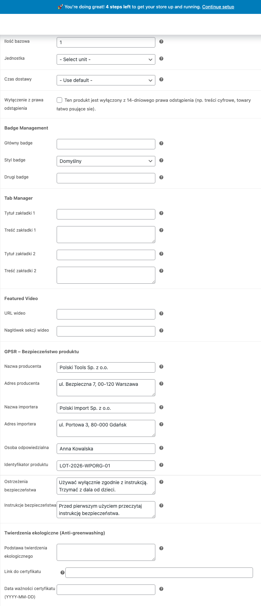

Nařízení GPSR (General Product Safety Regulation, EU 2023/988) platí od 13. prosince 2024. Vyžaduje uvádění informací o bezpečnosti produktů prodávaných v EU. Polski for WooCommerce přidává produktová pole, sloupec stavu a import/export CSV - vše, co potřebujete, bez dalších pluginů.

## Požadavky GPSR

Každý nepotravinový produkt prodávaný v EU musí obsahovat:

1. **Údaje výrobce** - název, adresa, kontaktní údaje
2. **Údaje dovozce** - pokud má výrobce sídlo mimo EU
3. **Odpovědná osoba v EU** - vyžadována pro produkty mimo EU
4. **Identifikátory produktu** - číslo šarže, sériové číslo, kód EAN/GTIN
5. **Varování** - informace o rizicích a věkových omezeních
6. **Bezpečnostní pokyny** - zásady bezpečného používání
7. **Fotografie/dokumenty** - volitelné přílohy (bezpečnostní listy, certifikáty)
8. **Kategorie rizika** - klasifikace úrovně rizika produktu

## Konfigurace polí GPSR

Pole GPSR najdete v editaci produktu, v záložce **Polski - GPSR**. Každé pole je volitelné, ale vyplňte všechna, která se týkají daného produktu.



### Výrobce

Vyplňte úplné údaje o výrobci:

- Název firmy
- Adresa (ulice, PSČ, město, země)
- E-mailová adresa
- Telefonní číslo
- Webová stránka

### Dovozce

Vyžadováno, pokud má výrobce sídlo mimo EU. Uveďte stejné údaje jako u výrobce.

### Odpovědná osoba v EU

Každý nepotravinový produkt od subjektu mimo EU musí mít odpovědnou osobu se sídlem v Unii. Uveďte:

- Název firmy nebo jméno a příjmení
- Adresa v EU
- Kontaktní údaje (e-mail, telefon)

### Identifikátory produktu

- **Číslo šarže (LOT)** - identifikátor výrobní šarže
- **Sériové číslo** - unikátní identifikátor kusu
- **EAN/GTIN** - čárový kód produktu
- **Číslo modelu** - označení modelu

### Varování a omezení

Textové pole pro informace o:

- Rizicích spojených s používáním
- Věkových omezeních (např. "Nevhodné pro děti do 3 let")
- Požadavcích na dohled dospělé osoby
- Nebezpečných látkách

### Bezpečnostní pokyny

Pole pro pokyny týkající se:

- Správné montáže a instalace
- Bezpečného používání
- Údržby a skladování
- Postupu v případě nehody

## Sloupec stavu GPSR

Na seznamu produktů (**Produkty > Všechny produkty**) plugin přidává sloupec **GPSR** se stavem vyplnění:

- Zelená ikona - všechna vyžadovaná pole vyplněna
- Oranžová ikona - částečně vyplněno
- Červená ikona - chybí údaje GPSR

Sloupec umožňuje rychle najít produkty, které vyžadují doplnění údajů.

## Import a export CSV

### Export

Při exportu produktů (**Produkty > Exportovat**) plugin přidává sloupce GPSR do souboru CSV:

- `gpsr_manufacturer_name`
- `gpsr_manufacturer_address`
- `gpsr_manufacturer_email`
- `gpsr_manufacturer_phone`
- `gpsr_manufacturer_url`
- `gpsr_importer_name`
- `gpsr_importer_address`
- `gpsr_importer_email`
- `gpsr_eu_responsible_name`
- `gpsr_eu_responsible_address`
- `gpsr_eu_responsible_email`
- `gpsr_identifiers_lot`
- `gpsr_identifiers_serial`
- `gpsr_identifiers_ean`
- `gpsr_identifiers_model`
- `gpsr_warnings`
- `gpsr_instructions`

### Import

Připravte soubor CSV se stejnými hlavičkami jako při exportu. Importujte přes **Produkty > Importovat**.

Tip: nejprve exportujte několik produktů, získáte šablonu CSV se správnými hlavičkami.

## Shortcode

Použijte shortcode `[polski_gpsr]` pro zobrazení informací GPSR na stránce produktu nebo na libovolném místě webu.

### Základní použití

```
[polski_gpsr]
```

Zobrazí data GPSR aktuálního produktu (funguje na stránce produktu WooCommerce).

### S určením produktu

```
[polski_gpsr product_id="123"]
```

Zobrazí data GPSR pro produkt se zadaným ID.

### Příklad výstupu

Shortcode generuje formátovanou tabulku se sekcemi:

| Sekce | Obsah |
|--------|-----------|
| Výrobce | Název, adresa, e-mail, telefon, web |
| Dovozce | Název, adresa, e-mail (pokud se týká) |
| Odpovědná osoba v EU | Název, adresa, kontaktní údaje |
| Identifikátory | LOT, sériové číslo, EAN, model |
| Varování | Text varování |
| Pokyny | Text bezpečnostních pokynů |

## Hromadné doplňování dat

Pokud má mnoho produktů stejného výrobce, nejrychlejší metoda je:

1. Exportujte produkty do CSV
2. Vyplňte sloupce výrobce pro všechny řádky (kopírovat-vložit v tabulkovém procesoru)
3. Importujte aktualizovaný soubor CSV

## Řešení problémů

**Pole GPSR se nezobrazují v editaci produktu**
Ujistěte se, že je modul GPSR zapnutý v nastavení pluginu: **WooCommerce > Nastavení > Polski > Moduly**.

**Sloupec stavu se nezobrazuje na seznamu produktů**
Klikněte na tlačítko "Možnosti obrazovky" v pravém horním rohu stránky se seznamem produktů a zaškrtněte sloupec GPSR.

**Data se neimportují z CSV**
Zkontrolujte, zda hlavičky sloupců v souboru CSV přesně odpovídají formátu exportu. Názvy sloupců jsou citlivé na velikost písmen.

## Další kroky

- Nahlašujte problémy: [GitHub Issues](https://github.com/wppoland/polski/issues)
- Diskuse a dotazy: [GitHub Discussions](https://github.com/wppoland/polski/discussions)

<div class="disclaimer">Tato stránka má pouze informativní charakter a nepředstavuje právní poradenství. Před nasazením se poraďte s právníkem. Polski for WooCommerce je open source software (GPLv2) poskytovaný bez záruky.</div>
