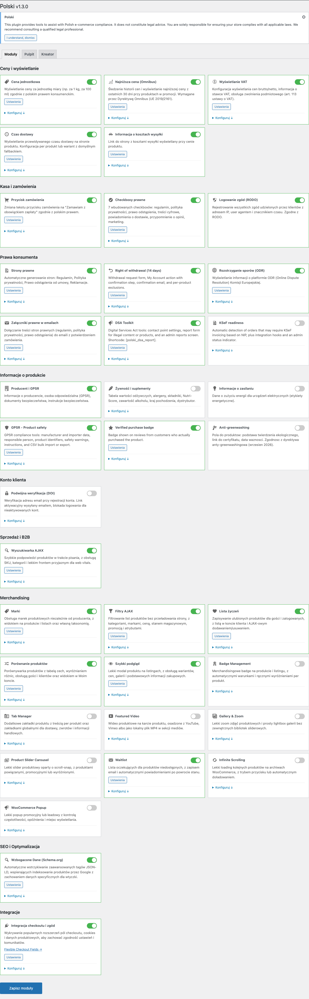

## Co je Polski for WooCommerce?

**Polski for WooCommerce** je bezplatný open source plugin (GPLv2) od [wppoland.com](https://wppoland.com). Přizpůsobuje obchod WooCommerce polským předpisům a standardům e-commerce. Obsahuje více než 30 modulů: právní požadavky, ceny, pokladnu, potraviny, obchodní funkce a nástroje pro vývojáře.

Aktuální verze: **1.3.2**

### Systémové požadavky

Před instalací se ujistěte, že váš server splňuje minimální požadavky:

| Požadavek | Minimální verze |
|-----------|-----------------|
| WordPress | 6.4 nebo novější |
| WooCommerce | 8.0 nebo novější |
| PHP | 8.1 nebo novější |
| MySQL | 5.7 nebo novější / MariaDB 10.3+ |

:::tip[Doporučení]
Pro nejlepší výkon doporučujeme PHP 8.2+ a WooCommerce 9.x. Plugin je pravidelně testován s nejnovějšími verzemi WordPress a WooCommerce.
:::

---

## Přehled modulů

Plugin funguje modulárně - zapínáte jen to, co potřebujete. Níže najdete popis všech skupin modulů.

### Právní požadavky

Moduly pro splnění požadavků polského a unijního práva:

- **GPSR (bezpečnost produktů)** - údaje výrobce, dovozce a odpovědné osoby na kartách produktů
- **Omnibus** - nejnižší cena za 30 dní před zlevněním
- **Právo na odstoupení** - formuláře pro vrácení zboží a dokumenty odstoupení
- **GDPR** - souhlasy, anonymizace dat, evidence zpracování
- **DSA (Akt o digitálních službách)** - kontaktní místo, nahlašování obsahu
- **KSeF** - příprava na Národní systém e-faktur
- **Greenwashing** - kontrola environmentálních prohlášení
- **Právní stránky** - obchodní podmínky, zásady ochrany osobních údajů a zásady vrácení zboží

### Ceny a informace o produktu

Moduly pro zobrazování cen a produktových dat:

- **Jednotkové ceny** - automatický přepočet a zobrazování cen za měrnou jednotku (zł/kg, zł/l)
- **Zobrazování DPH** - informace o sazbě DPH a ceně bez/s daní
- **Doba dodání** - odhadovaná doba realizace objednávky na kartě produktu
- **Údaje výrobce** - pole výrobce, značka, katalogové číslo

### Pokladna a objednávky

Moduly pro stránku pokladny a proces objednávky:

- **Tlačítko objednávky** - změna textu tlačítka na "Objednávám s povinností platby" (právní požadavek)
- **Právní checkboxy** - konfigurovatelné souhlasy s obchodními podmínkami, zásadami ochrany osobních údajů, newsletterem
- **Vyhledávání NIP** - automatické doplnění firemních údajů podle čísla NIP (API GUS)
- **Dvojité potvrzení** - ověření e-mailové adresy (double opt-in)

### Potravinové produkty

Specializované moduly pro obchody s potravinami:

- **Přehled potravinových produktů** - vyhrazená pole pro potravinové produkty
- **Výživové hodnoty** - tabulka výživových hodnot v souladu s nařízením 1169/2011
- **Alergeny** - zvýrazněné alergeny v popisu produktu (14 hlavních alergenů)
- **Nutri-Score** - zobrazování označení Nutri-Score (A-E)

### Obchodní moduly

Funkce usnadňující nákup zákazníkům:

- **Seznam přání** - ukládání produktů na později
- **Porovnávač** - porovnávání produktů vedle sebe
- **Rychlý náhled** - náhled produktu bez opuštění stránky kategorie
- **Vyhledávač AJAX** - vyhledávání produktů v reálném čase
- **Filtry AJAX** - dynamické filtrování produktů bez načítání stránky
- **Slider produktů** - karusely produktů s konfigurovatelnými nastaveními
- **Odznaky produktů** - štítky typu "Novinka", "Bestseller", "Poslední kusy"
- **Další moduly** - doplňkové obchodní funkce

### Nástroje

Moduly pro správu obchodu:

- **Dashboard souladu** - přehled stavu právních požadavků obchodu na jednom místě
- **Audit obchodu** - automatické ověření konfigurace obchodu
- **Bezpečnostní incidenty** - evidence a správa incidentů GDPR
- **Ověřené recenze** - systém ověřených recenzí zákazníků

### Pro vývojáře

Nástroje a API pro programátory:

- **REST API** - endpointy pro správu dat pluginu
- **Hooky (akce a filtry)** - více než 100 hooků pro rozšiřování funkčnosti
- **Shortcody** - hotové shortcody pro vkládání prvků do obsahu
- **Šablony** - přepisování šablon pluginu v šabloně
- **WP-CLI** - CLI příkazy pro správu pluginu z terminálu
- **Import CSV** - hromadný import produktových dat
- **Bloky Gutenberg** - vyhrazené bloky editoru
- **Schema.org** - automatická strukturovaná data pro produkty

---

## Rychlý start

Tři kroky k obchodu v souladu s předpisy:

1. **[Nainstalujte plugin](getting-started/installation/)** - z panelu WordPress nebo ručně ze souboru ZIP
2. **[Nakonfigurujte základy](getting-started/configuration/)** - zapněte potřebné moduly v panelu nastavení
3. **[Projděte průvodce](getting-started/wizard/)** - doplňte údaje firmy, vygenerujte právní stránky, nakonfigurujte checkboxy

:::note[Potřebujete pomoc?]
Pokud narazíte na problém, nahlaste ho na [GitHub Issues](https://github.com/wppoland/polski/issues). Máte otázku nebo návrh? Napište na [GitHub Discussions](https://github.com/wppoland/polski/discussions).
:::

---

## Proč se vyplatí?

- **Vše v jednom** - místo 10 pluginů jedna ucelená platforma
- **Modulární stavba** - zapínáte jen to, co potřebujete
- **Právní požadavky** - aktualizované spolu se změnami předpisů
- **Open source** - zdrojový kód na GitHubu, licence GPLv2
- **Bez předplatného** - všechny funkce dostupné zdarma
- **Výkon** - zdroje načítané jen pro aktivní moduly
- **Aktivní komunita** - podpora na GitHub Discussions

---

## Kompatibilita

Plugin je testován s populárními šablonami a pluginy WordPress:

- Šablony: Storefront, Astra, GeneratePress, Kadence, Flavor, flavor theme
- Page buildery: Gutenberg (bloky), Elementor, Beaver Builder
- Platební pluginy: Przelewy24, PayU, BLIK, tpay
- Doručovací pluginy: InPost, DPD, DHL, Poczta Polska, Orlen Paczka

---

## Podpora a komunita

- [GitHub Issues](https://github.com/wppoland/polski/issues) - nahlašování chyb a návrhů funkcí
- [GitHub Discussions](https://github.com/wppoland/polski/discussions) - otázky, diskuze, pomoc komunity
- [wppoland.com](https://wppoland.com) - stránka projektu a blog s návody

Tato stránka má výhradně informativní charakter a nepředstavuje právní poradenství. Před nasazením se poraďte s právníkem. Polski for WooCommerce je open source software (GPLv2) dodávaný bez záruky.

