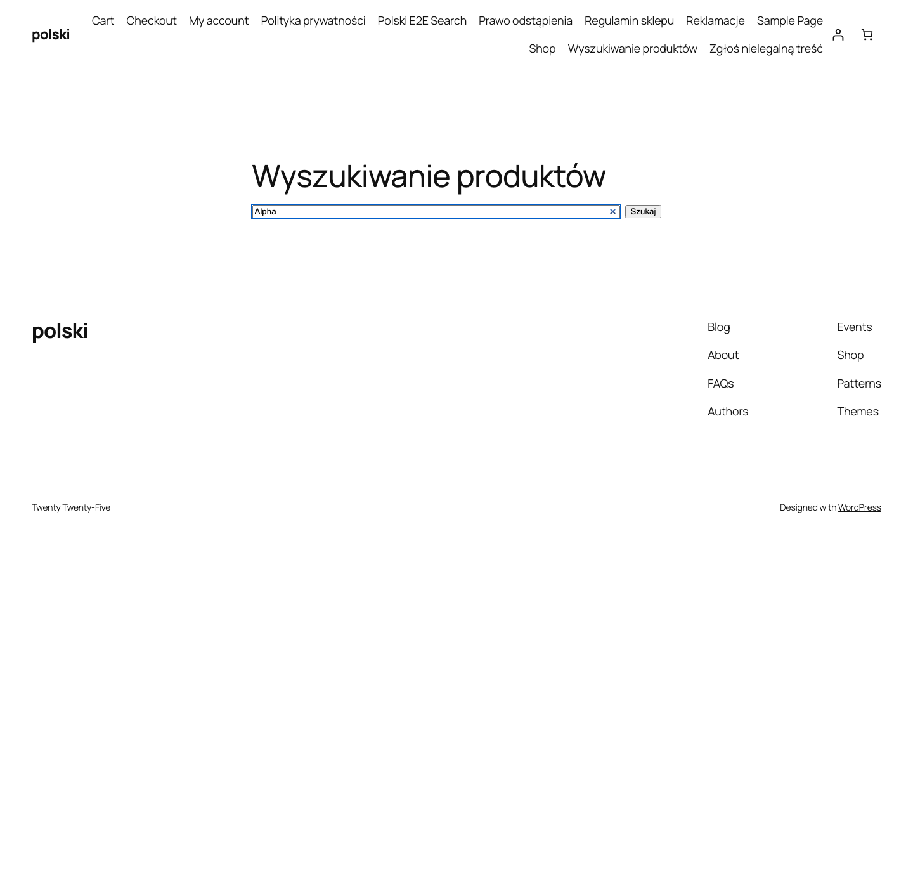

Vyhledávač AJAX nahrazuje výchozí vyhledávání WooCommerce. Výsledky se zobrazují živě během psaní, bez znovunačtení stránky.

## Zapnutí modulu

Přejděte do **WooCommerce > Polski > Moduly obchodu** a zapněte **Vyhledávač AJAX**. Modul automaticky nahradí výchozí widget vyhledávání.



## Prohledávaná pole

Vyhledávač prohledává více polí produktu najednou:

### SKU (katalogové číslo)

Zákazník může zadat číslo SKU nebo jeho část. Užitečné v B2B obchodech, kde zákazníci objednávají podle katalogových čísel.

### Výrobce (manufacturer)

Když je aktivní modul **Výrobce**, vyhledávač zohledňuje název výrobce. Zadání "Samsung" zobrazí všechny produkty této značky.

### GTIN (EAN/UPC)

Zákazník může zadat celý čárový kód GTIN/EAN/UPC nebo jeho část.

### Doplňková pole

- Název produktu
- Krátký popis
- Kategorie
- Štítky
- Atributy (barva, velikost atd.)

Konfigurace prohledávaných polí: **WooCommerce > Polski > Moduly obchodu > Vyhledávač AJAX > Pole vyhledávání**.

## Výsledky vyhledávání

Rozbalovací nabídka s výsledky zobrazuje:

- Miniaturu produktu
- Název produktu (se zvýrazněním odpovídajících částí)
- Cenu
- Kategorii
- Hodnocení (hvězdičky)
- Stav dostupnosti

Ve výchozím nastavení se zobrazuje až **8 návrhů**. Limit lze změnit:

```php
add_filter('polski/ajax_search/results_limit', function (): int {
    return 12;
});
```

Minimální počet znaků pro zahájení vyhledávání je **3**. Změna:

```php
add_filter('polski/ajax_search/min_chars', function (): int {
    return 2;
});
```

## REST API endpoint

Vyhledávač používá vlastní REST API endpoint místo `admin-ajax.php`. Díky tomu funguje rychleji.

**Endpoint:** `GET /wp-json/polski/v1/search`

**Parametry:**

| Parametr | Typ    | Povinný | Popis                          |
| -------- | ------ | -------- | ----------------------------- |
| `q`      | string | Ano      | Hledaný výraz                 |
| `limit`  | int    | Ne       | Limit výsledků (výchozí 8)    |
| `cat`    | int    | Ne       | ID kategorie pro filtrování   |

**Příklad požadavku:**

```bash
curl "https://vasobchod.cz/wp-json/polski/v1/search?q=tricko&limit=5"
```

**Příklad odpovědi:**

```json
{
  "results": [
    {
      "id": 123,
      "title": "Bavlněné tričko",
      "url": "https://vasobchod.cz/produkt/bavlnene-tricko/",
      "image": "https://vasobchod.cz/wp-content/uploads/tricko.jpg",
      "price_html": "<span class=\"amount\">49,00&nbsp;Kč</span>",
      "category": "Oblečení",
      "in_stock": true,
      "rating": 4.5
    }
  ],
  "total": 1,
  "query": "tricko"
}
```

## Blok Gutenberg

Blok **Polski - Vyhledávač AJAX** je dostupný v editoru Gutenberg. Umístěte jej do libovolného příspěvku, stránky nebo widgetu.

Možnosti bloku:

- **Placeholder** - zástupný text v poli vyhledávání
- **Šířka** - šířka pole (auto, plná, vlastní v px)
- **Ikona** - zobrazit/skrýt ikonu lupy
- **Filtr kategorií** - zobrazit rozbalovací filtr podle kategorie vedle pole vyhledávání
- **Styl** - zaoblené rohy, ohraničení, stín

V editoru klikněte na **+** a vyhledejte **Polski** nebo **Vyhledávač AJAX**.

## Widget Elementor

Widget **Polski AJAX Search** je dostupný v kategorii **Polski for WooCommerce** v panelu Elementoru.

Kromě možností bloku Gutenberg widget nabízí:

- Kontrola typografie (rodina fontu, velikost, tloušťka)
- Barvy (pozadí, text, ohraničení, hover)
- Okraje a paddingy
- Animace zobrazení výsledků
- Responzivita (nastavení pro každý breakpoint)

## Shortcode `[polski_ajax_search]`

### Parametry

| Parametr      | Typ    | Výchozí             | Popis                              |
| ------------- | ------ | ------------------- | ---------------------------------- |
| `placeholder` | string | `Szukaj produktów…` | Zástupný text                      |
| `width`       | string | `100%`              | Šířka pole                         |
| `show_icon`   | string | `yes`               | Zobrazit ikonu lupy                |
| `show_cat`    | string | `no`                | Zobrazit filtr kategorií           |
| `limit`       | int    | `8`                 | Maximální počet návrhů             |

### Příklad použití

```html
[polski_ajax_search placeholder="Co hledáte?" show_cat="yes" limit="10"]
```

### Vložení do hlavičky šablony

```php
// V functions.php šablony
add_action('wp_body_open', function (): void {
    echo do_shortcode('[polski_ajax_search placeholder="Hledat..." width="400px"]');
});
```

## Debouncing a výkon

Vyhledávač používá debouncing 300 ms, požadavek se odešle teprve 300 ms po posledním stisknutí klávesy. Tím se zabrání příliš velkému počtu dotazů při rychlém psaní.

Výsledky se ukládají do mezipaměti prohlížeče. Opětovné zadání stejného výrazu neodešle dotaz na server.

Na serveru se výsledky ukládají do transient API (výchozí 1 hodina). Mezipaměť se automaticky vymaže po uložení, přidání nebo odstranění produktu.

```php
// Změna doby mezipaměti
add_filter('polski/ajax_search/cache_ttl', function (): int {
    return 1800; // 30 minut v sekundách
});
```

## Stylování CSS

CSS třídy modulu:

- `.polski-ajax-search` - kontejner vyhledávače
- `.polski-ajax-search__input` - textové pole
- `.polski-ajax-search__results` - rozbalovací nabídka s výsledky
- `.polski-ajax-search__item` - jednotlivý výsledek
- `.polski-ajax-search__item--active` - zvýrazněný výsledek (navigace klávesnicí)
- `.polski-ajax-search__highlight` - zvýraznění odpovídající části
- `.polski-ajax-search__loading` - spinner načítání

## Přístupnost

Vyhledávač podporuje navigaci klávesnicí:

- **Šipka dolů/nahoru** - navigace mezi výsledky
- **Enter** - přechod na vybraný produkt
- **Escape** - zavření rozbalovací nabídky
- ARIA atributy: `role="combobox"`, `aria-expanded`, `aria-activedescendant`

Hlášení problémů: [github.com/wppoland/polski/issues](https://github.com/wppoland/polski/issues)

<div class="disclaimer">Tato stránka má pouze informativní charakter a nepředstavuje právní poradenství. Před nasazením se poraďte s právníkem. Polski for WooCommerce je software s otevřeným zdrojovým kódem (GPLv2) poskytovaný bez záruky.</div>
