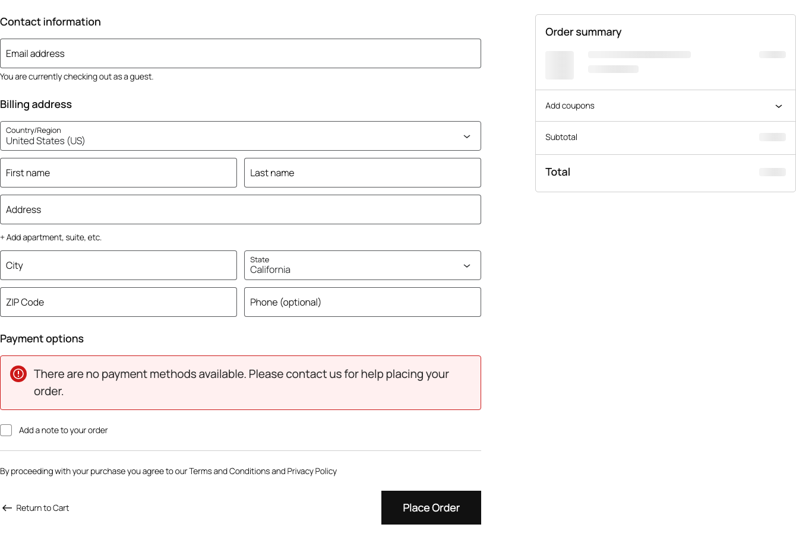

Das polnische Recht verlangt, dass der Bestellbutton den Text "Bestellung mit Zahlungspflicht" oder einen ähnlichen Text enthält. Das Plugin Polski for WooCommerce ändert den Standardtext des WooCommerce-Buttons automatisch.

## Rechtliche Anforderungen

Der Button muss klar auf die Zahlungspflicht hinweisen. Akzeptierte Varianten:

- "Zahlungspflichtig bestellen"
- "Bestellen und bezahlen"
- "Kaufen und bezahlen"

Texte wie "Bestellung aufgeben", "Bestellen" oder "Bestätigen" erfüllen die Anforderungen nicht und können zu Bußgeldern führen.



## Konfiguration

Gehe zu **WooCommerce > Einstellungen > Polski > Checkout** und konfiguriere den Bereich "Bestellbutton".

### Einstellungen

| Einstellung | Standardwert | Beschreibung |
|------------|-----------------|------|
| Button-Text | Zahlungspflichtig bestellen | Der auf dem Button angezeigte Text |
| Für alle Zahlungsmethoden überschreiben | Ja | Ob der Text unabhängig von der gewählten Methode angewendet wird |
| Texte der Zahlungsgateways überschreiben | Ja | Ob die von Gateway-Plugins gesetzten Texte überschrieben werden |

### Texte pro Zahlungsmethode

Manche Zahlungsgateways (z. B. PayPal, Przelewy24) setzen eigene Button-Texte. Das Plugin erlaubt die Wahl:

1. **Alle überschreiben** - zeigt immer den eingestellten Text an (empfohlen)
2. **Gateway-Texte beibehalten** - erlaubt den Gateways, eigene Texte zu setzen (stelle sicher, dass sie rechtskonform sind)

## Technische Umsetzung

Das Plugin ändert den Button-Text über einen WooCommerce-Filter:

```php
add_filter('woocommerce_order_button_text', function (): string {
    return 'Zahlungspflichtig bestellen';
});
```

### Kompatibilität mit dem Block-Checkout

Das Plugin funktioniert mit dem klassischen Checkout (Shortcode) und dem Block-Checkout (Gutenberg). Der Block-Checkout nutzt:

- den Filter `woocommerce_order_button_text` (klassisch)
- den Endpunkt der Store API (Block-Checkout)

### Kompatibilität mit gängigen Plugins

Das Plugin funktioniert mit den gängigen Zahlungsgateways in Polen:

- Przelewy24
- PayU
- Tpay
- Stripe
- PayPal
- BLIK (über verschiedene Gateways)

## Anpassung des Textes

### Text in den Einstellungen ändern

Ändere den Text unter **WooCommerce > Einstellungen > Polski > Checkout**. Der neue Text muss weiterhin über die Zahlungspflicht informieren.

### Text programmatisch ändern

```php
add_filter('woocommerce_order_button_text', function (string $text): string {
    return 'Kaufen und bezahlen';
}, 20);
```

Die Priorität `20` stellt sicher, dass der Filter nach dem Plugin-Filter (Priorität `10`) ausgeführt wird.

### Text abhängig von der Zahlungsmethode

```php
add_filter('woocommerce_order_button_text', function (string $text): string {
    $chosen_payment = WC()->session->get('chosen_payment_method');

    if ($chosen_payment === 'bacs') {
        return 'Zahlungspflichtig per Überweisung bestellen';
    }

    if ($chosen_payment === 'cod') {
        return 'Zahlungspflichtig per Nachnahme bestellen';
    }

    return 'Zahlungspflichtig bestellen';
}, 20);
```

## Styling des Buttons

Der Button verwendet die Standard-CSS-Klassen von WooCommerce. Passe sein Aussehen an:

```css
#place_order {
    background-color: #2e7d32;
    font-size: 1.1em;
    font-weight: 700;
    padding: 0.8em 2em;
    text-transform: none;
}

#place_order:hover {
    background-color: #1b5e20;
}
```

Für den Block-Checkout:

```css
.wc-block-components-checkout-place-order-button {
    background-color: #2e7d32;
    font-weight: 700;
}
```

## Testen

Prüfe den Button nach der Konfiguration in folgenden Szenarien:

1. Checkout mit verschiedenen Zahlungsmethoden
2. Checkout als Gast und als angemeldeter Benutzer
3. Checkout mit Rabattgutschein (Coupon)
4. Checkout mit Abonnement (falls du WooCommerce Subscriptions verwendest)
5. Mobiler Checkout - stelle sicher, dass der Text nicht abgeschnitten wird

## Häufige Probleme

### Der Button-Text kehrt zum Standard "Place order" zurück

Prüfe, ob:

1. Das Plugin aktiv ist und das Checkout-Modul aktiviert ist
2. Kein anderes Plugin den Filter mit höherer Priorität überschreibt
3. Das Theme den Button-Text nicht im Template fest verdrahtet

### Der Text wird auf mobilen Geräten abgeschnitten

Der Text "Zahlungspflichtig bestellen" passt möglicherweise nicht auf kleine Bildschirme. Lösungen:

- Verwendung einer kürzeren Variante: "Kaufen und bezahlen"
- Anpassung des CSS: `white-space: normal` auf dem Button

### Der Block-Checkout ändert den Text nicht

Prüfe, ob du die neueste Version des Plugins hast. Ältere Versionen unterstützen den Block-Checkout möglicherweise nicht. Aktualisiere auch WooCommerce Blocks.

## Verwandte Ressourcen

- [Problem melden](https://github.com/wppoland/polski/issues)

<div class="disclaimer">Diese Seite dient ausschließlich Informationszwecken und stellt keine Rechtsberatung dar. Konsultiere vor der Umsetzung einen Anwalt. Polski for WooCommerce ist Open-Source-Software (GPLv2), bereitgestellt ohne Gewährleistung.</div>
