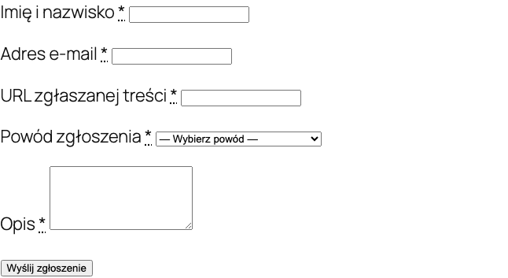

Der Digital Services Act (EU 2022/2065) verlangt, dass Plattformen die Meldung illegaler Inhalte ermoeglichen. Das Plugin fuegt ein Meldeformular, ein Verwaltungspanel, Statusverfolgung und automatische E-Mail-Benachrichtigungen hinzu.

## DSA-Anforderungen fuer Onlineshops

Seit dem 17. Februar 2024 muessen Onlineshops, die Nutzern das Veroeffentlichen von Inhalten ermoeglichen (Rezensionen, Kommentare, Fotos):

1. Einen Mechanismus zur Meldung illegaler Inhalte bereitstellen
2. Den Eingang der Meldung bestaetigen
3. Die Meldung innerhalb einer angemessenen Frist bearbeiten
4. Den Meldenden ueber die Entscheidung informieren
5. Einen Widerspruch gegen die Entscheidung ermoeglichen

Die Pflicht betrifft Shops, die Nutzern das Veroeffentlichen von Inhalten ermoeglichen - insbesondere Produktbewertungen.

## Meldeformular

### Shortcode

Betten Sie das DSA-Meldeformular auf einer beliebigen Seite mit dem Shortcode ein:

```
[polski_dsa_report]
```

### Mit Parametern

```
[polski_dsa_report product_id="123" category="illegal_content"]
```

### Shortcode-Parameter

| Parameter | Beschreibung | Standardwert |
|----------|------|------------------|
| `product_id` | ID des Produkts, auf das sich die Meldung bezieht | Keiner (Nutzer waehlt) |
| `category` | Vorausgewaehlte Meldekategorie | Keiner |



### Formularfelder

Das Formular enthaelt folgende Felder:

- **Meldekategorie** - Auswahl aus einer Liste (illegaler Inhalt, Urheberrechtsverletzung, gefaelschte Rezension, Hassrede, personenbezogene Daten, Sonstige)
- **URL oder Inhalts-ID** - Link zum gemeldeten Inhalt oder Rezensions-ID
- **Beschreibung** - detaillierte Problembeschreibung
- **Rechtsgrundlage** - optionale Angabe der Vorschrift
- **Kontaktdaten** - Name, E-Mail-Adresse des Meldenden
- **Erklaerung** - Checkbox zur Bestaetigung, dass die Meldung in gutem Glauben erfolgt

### Einbettungsbeispiel

Erstellen Sie eine Seite "Inhalt melden" und fuegen Sie den Shortcode hinzu:

```
[polski_dsa_report]
```

Fuegen Sie dann einen Link zu dieser Seite in der Shop-Fusszeile hinzu, damit sie fuer Nutzer leicht zugaenglich ist.

## Administrationspanel

DSA-Meldungen werden im WordPress-Panel unter **WooCommerce > DSA-Meldungen** verwaltet.

### Meldungsliste

Die Liste zeigt alle Meldungen mit folgenden Spalten:

- Meldungs-ID
- Eingangsdatum
- Kategorie
- Status (neu, in Bearbeitung, bearbeitet, abgelehnt)
- Meldender (Name, E-Mail)
- Link zum Inhalt

### Meldungsdetails

Beim Klick auf eine Meldung sieht der Administrator:

- Vollstaendige Formulardaten
- Vorschau des gemeldeten Inhalts (bei Rezensionen - direkter Link)
- Statusaenderungshistorie
- Feld fuer interne Notiz
- Aktionsbuttons (Status aendern, Inhalt entfernen, ablehnen)

### Meldungsstatus

| Status | Beschreibung |
|--------|------|
| `new` | Neue Meldung, wartet auf Bearbeitung |
| `in_progress` | Meldung wird analysiert |
| `resolved` | Meldung bearbeitet, Inhalt entfernt oder andere Massnahme ergriffen |
| `rejected` | Meldung als unberechtigt abgelehnt |
| `appealed` | Meldender hat Widerspruch gegen die Entscheidung eingelegt |

## E-Mail-Benachrichtigungen

Das System sendet automatische E-Mail-Benachrichtigungen in folgenden Situationen:

| Ereignis | Empfaenger | Inhalt |
|-----------|----------|-------|
| Neue Meldung | Administrator | Information ueber neue Meldung mit Daten |
| Bestaetigung | Meldender | Bestaetigung des Meldungseingangs mit ID-Nummer |
| Statusaenderung | Meldender | Information ueber Statusaenderung mit Begruendung |
| Bearbeitung | Meldender | Entscheidung mit Begruendung und Information ueber Widerspruchsrecht |

E-Mail-Vorlagen koennen unter **WooCommerce > Einstellungen > E-Mails** angepasst werden.

## Hook

### polski/dsa/report_created

Wird nach dem Erstellen einer neuen DSA-Meldung aufgerufen.

```php
/**
 * @param int    $report_id   ID der DSA-Meldung.
 * @param array  $report_data Meldungsdaten.
 * @param string $category    Meldungskategorie.
 */
add_action('polski/dsa/report_created', function (int $report_id, array $report_data, string $category): void {
    // Beispiel: Benachrichtigung an das Rechtsteam ueber Slack senden
    $webhook_url = 'https://hooks.slack.com/services/XXXX/YYYY/ZZZZ';
    
    wp_remote_post($webhook_url, [
        'body' => wp_json_encode([
            'text' => sprintf(
                'Neue DSA-Meldung #%d (Kategorie: %s) - %s',
                $report_id,
                $category,
                $report_data['description']
            ),
        ]),
        'headers' => ['Content-Type' => 'application/json'],
    ]);
}, 10, 3);
```

### Beispiel - automatisches Ausblenden von Rezensionen einer bestimmten Kategorie

```php
add_action('polski/dsa/report_created', function (int $report_id, array $report_data, string $category): void {
    // Automatisch Rezensionen ausblenden, die als Hassrede gemeldet wurden
    if ($category !== 'hate_speech') {
        return;
    }
    
    $comment_id = $report_data['content_id'] ?? 0;
    if ($comment_id > 0) {
        wp_set_comment_status($comment_id, 'hold');
        
        // Automatische Aktion protokollieren
        update_post_meta($report_id, '_auto_action', 'comment_held');
    }
}, 10, 3);
```

## Berichtswesen

Die DSA erfordert die Fuehrung eines Meldungsregisters. Das Plugin ermoeglicht den Export aller Meldungen als CSV (**WooCommerce > DSA-Meldungen > Exportieren**). Der Export enthaelt:

- Meldungs-ID
- Datum und Uhrzeit der Einreichung
- Kategorie
- Status und Bearbeitungsdatum
- Bearbeitungszeit (in Stunden)
- Ergriffene Massnahme

## Konfiguration

Moduleinstellungen finden Sie unter **WooCommerce > Einstellungen > Polski > DSA**.

| Option | Beschreibung | Standardwert |
|-------|------|------------------|
| DSA-Formular aktivieren | Aktiviert das Modul | Ja |
| Formularseite | WordPress-Seite mit Shortcode | Keine |
| Administrator-E-Mail | E-Mail-Adresse fuer Benachrichtigungen | WordPress-Administrator-E-Mail |
| Bearbeitungsfrist | Anzahl Werktage fuer die Bearbeitung | 7 |
| Meldekategorien | Liste verfuegbarer Kategorien | Standardliste |

## Fehlerbehebung

**Formular wird auf der Seite nicht angezeigt**
Stellen Sie sicher, dass der Shortcode `[polski_dsa_report]` korrekt auf der Seite eingebettet ist und das DSA-Modul in den Einstellungen aktiviert ist.

**E-Mail-Benachrichtigungen kommen nicht an**
Pruefen Sie die WordPress-SMTP-Konfiguration. Die Standard-Funktion `wp_mail()` funktioniert moeglicherweise nicht auf allen Servern. Erwaegen Sie die Installation eines SMTP-Plugins (z.B. WP Mail SMTP).

**Meldungen erscheinen nicht im Panel**
Pruefen Sie die Benutzerberechtigungen. Die Verwaltung von DSA-Meldungen erfordert die Rolle `shop_manager` oder `administrator`.

## Weitere Schritte

- Probleme melden: [GitHub Issues](https://github.com/wppoland/polski/issues)
- Diskussionen und Fragen: [GitHub Discussions](https://github.com/wppoland/polski/discussions)

<div class="disclaimer">Diese Seite dient ausschließlich zu Informationszwecken und stellt keine Rechtsberatung dar. Konsultieren Sie vor der Umsetzung einen Anwalt. Polski for WooCommerce ist Open-Source-Software (GPLv2) ohne Garantie.</div>
