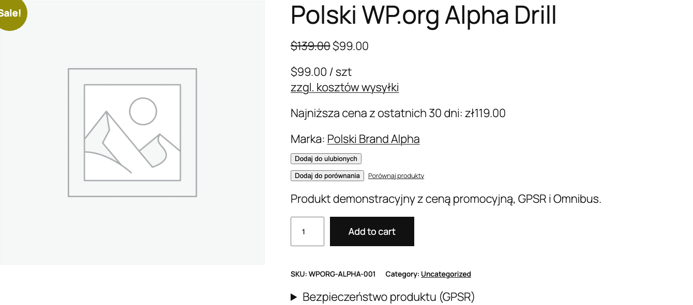

Die Omnibus-Richtlinie (EU 2019/2161) gilt in Polen seit dem 1. Januar 2023. Bei jeder Preissenkung muss der niedrigste Preis der letzten 30 Tage angezeigt werden. Das Plugin verfolgt automatisch die Preishistorie und zeigt die Information bei Aktionen an.

## Wie die Preisverfolgung funktioniert

Das Plugin registriert jede Preisaenderung eines WooCommerce-Produkts (einschliesslich variabler Produkte) und speichert die Historie in der Datenbank. Wenn ein Produkt als "im Angebot" markiert ist, berechnet das System automatisch den niedrigsten Preis der letzten 30 Tage und zeigt ihn den Kunden an.

Die Verfolgung beginnt nach Modulaktivierung. Ohne Preishistorie zeigt das Plugin eine Ersatzmeldung an.



## Konfiguration

Gehen Sie zu **WooCommerce > Einstellungen > Polski > Omnibus** und konfigurieren Sie die verfuegbaren Optionen.

### Verfolgungszeitraum

| Option | Beschreibung | Standardwert |
|-------|------|------------------|
| `days` | Anzahl der Tage zurueck zur Berechnung des niedrigsten Preises | `30` |
| `prune_after_days` | Nach wie vielen Tagen alte Eintraege aus der Historie loeschen | `90` |

Die Einstellung `prune_after_days` ermoeglicht die Kontrolle der Groesse der Preishistorietabelle in der Datenbank. Der Wert `90` bedeutet, dass Daten aelter als 90 Tage automatisch durch WP-Cron geloescht werden.

### Steuern

| Option | Beschreibung | Standardwert |
|-------|------|------------------|
| `include_tax` | Ob der angezeigte Omnibus-Preis die MwSt. enthalten soll | `true` |

Diese Option sollte mit den Preisanzeigeeinstellungen in WooCommerce uebereinstimmen. Wenn die Preise im Shop brutto angezeigt werden, setzen Sie auf `true`.

### Anzeigeorte

| Option | Beschreibung | Standardwert |
|-------|------|------------------|
| `display_on_sale_only` | Nur bei Produkten im Angebot anzeigen | `true` |
| `show_on_single` | Einzelproduktseite | `true` |
| `show_on_loop` | Produktliste (Kategorie, Shop) | `false` |
| `show_on_related` | Verwandte Produkte | `false` |
| `show_on_cart` | Warenkorb | `false` |

Empfehlung: Aktivieren Sie die Anzeige mindestens auf der Produktseite (`show_on_single`). Die Anzeige in der Produktliste (`show_on_loop`) kann viel Platz einnehmen, wird aber von einigen Gesetzesauslegungen verlangt.

### Regulaerer Preis

| Option | Beschreibung | Standardwert |
|-------|------|------------------|
| `show_regular_price` | Auch den regulaeren Preis neben dem Omnibus-Preis anzeigen | `false` |

### Textvorlage

| Option | Beschreibung | Standardwert |
|-------|------|------------------|
| `display_text` | Vorlage der angezeigten Meldung | `Niedrigster Preis der letzten {days} Tage vor der Senkung: {price}` |
| `no_history_text` | Text bei fehlender Preishistorie | `Keine frueheren Preisdaten verfuegbar` |

Verfuegbare Variablen in der Vorlage `display_text`:

- `{price}` - niedrigster Preis des Zeitraums
- `{days}` - Anzahl der Tage (Standard 30)
- `{date}` - Datum des niedrigsten Preises
- `{regular_price}` - regulaerer Preis des Produkts (vor der Aktion)

#### Vorlagenbeispiele

```
Niedrigster Preis der letzten {days} Tage vor der Senkung: {price}
```

```
Niedrigster Preis der letzten {days} Tage: {price} (regulaerer Preis: {regular_price})
```

```
Omnibus: {price} (vom {date})
```

### Art der Preisberechnung

| Option | Beschreibung | Standardwert |
|-------|------|------------------|
| `price_count_from` | Ab wann die 30 Tage zaehlen | `sale_start` |

Verfuegbare Werte:

- `sale_start` - ab dem Startdatum der Aktion (empfohlen von UOKiK)
- `current_date` - ab dem aktuellen Datum

### Variable Produkte

| Option | Beschreibung | Standardwert |
|-------|------|------------------|
| `variable_tracking` | Art der Variantenverfolgung | `per_variation` |

Verfuegbare Werte:

- `per_variation` - separate Verfolgung jeder Variante (empfohlen)
- `parent_only` - Verfolgung nur des uebergeordneten Produktpreises

Die Einstellung `per_variation` liefert genauere Daten, da jede Variante einen anderen Preis und eine andere Rabatthistorie haben kann.

## Shortcode

Verwenden Sie den Shortcode `[polski_omnibus_price]`, um die Information zum niedrigsten Preis an einer beliebigen Stelle der Website anzuzeigen.

### Grundlegende Verwendung

```
[polski_omnibus_price]
```

Zeigt den Omnibus-Preis fuer das aktuelle Produkt an.

### Mit Parametern

```
[polski_omnibus_price product_id="456" days="30"]
```

### Shortcode-Parameter

| Parameter | Beschreibung | Standardwert |
|----------|------|------------------|
| `product_id` | Produkt-ID | Aktuelles Produkt |
| `days` | Anzahl der Tage | Wert aus Einstellungen |

### Verwendungsbeispiel im PHP-Template

```php
echo do_shortcode('[polski_omnibus_price product_id="' . $product_id . '"]');
```

## Automatische Historienbereinigung

Das Plugin registriert einen WP-Cron-Job, der taeglich Preishistorieeintraege loescht, die aelter als der Wert `prune_after_days` sind. Dadurch waechst die Datenbanktabelle nicht unbegrenzt.

Zur manuellen Erzwingung der Bereinigung koennen Sie WP-CLI verwenden:

```bash
wp cron event run polski_omnibus_prune
```

## Konformitaet mit UOKiK-Vorschriften

Das Amt fuer Wettbewerb und Verbraucherschutz (UOKiK) weist darauf hin, dass:

1. Die Information zum niedrigsten Preis **bei jeder Preissenkungsankuendigung** angezeigt werden muss
2. Der Referenzzeitraum **30 Tage vor Anwendung der Senkung** betraegt
3. Fuer Produkte, die kuerzer als 30 Tage im Verkauf sind - den niedrigsten Preis seit Verkaufsbeginn angeben
4. Fuer leicht verderbliche Produkte - eine Verkuerzung des Zeitraums moeglich ist

Das Plugin haelt sich standardmaessig an diese Richtlinien. Die Option `price_count_from` auf `sale_start` gesetzt stellt die Zaehlung ab dem Aktionsstartdatum sicher, gemaess den UOKiK-Empfehlungen.

## Fehlerbehebung

**Omnibus-Preis wird nicht angezeigt**
Pruefen Sie, ob das Produkt in WooCommerce als "im Angebot" markiert ist (ein Aktionspreis muss gesetzt sein). Wenn die Option `display_on_sale_only` aktiviert ist, erscheint die Meldung nur bei aktiver Aktion.

**Meldung ueber fehlende Historie wird angezeigt**
Die Preisverfolgung beginnt ab der Modulaktivierung. Warten Sie auf die erste Preisaenderung oder speichern Sie das Produkt manuell, um einen Eintrag in der Historie zu initiieren.

**Omnibus-Preis ist gleich dem Aktionspreis**
Dies ist korrektes Verhalten, wenn das Produkt in den letzten 30 Tagen keinen niedrigeren Preis hatte.

## Weitere Schritte

- Probleme melden: [GitHub Issues](https://github.com/wppoland/polski/issues)
- Diskussionen und Fragen: [GitHub Discussions](https://github.com/wppoland/polski/discussions)

<div class="disclaimer">Diese Seite dient ausschließlich zu Informationszwecken und stellt keine Rechtsberatung dar. Konsultieren Sie vor der Umsetzung einen Anwalt. Polski for WooCommerce ist Open-Source-Software (GPLv2) ohne Garantie.</div>
