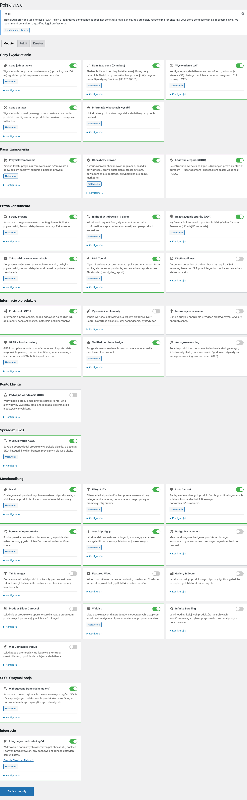

## Dwie wersje - jedno rozwiązanie

Polski for WooCommerce to modułowa platforma stworzona przez [wppoland.com](https://wppoland.com), która dostosowuje sklep WooCommerce do polskich wymogów rynkowych. Dostępna w dwóch wariantach:

| | FREE | PRO |
|---|---|---|
| Licencja | GPLv2 (open source) | Licencja komercyjna |
| Cena | Bezpłatnie | [wppoland.com/polski-pro](https://wppoland.com/polski-pro) |
| Wymogi prawne | GPSR, Omnibus, RODO, DSA, KSeF i inne | Wszystko z FREE |
| Ceny i produkty | Cena jednostkowa, VAT, czas dostawy | Wszystko z FREE |
| Kasa | Przycisk zamówienia, checkboxy, NIP | + wieloetapowy koszyk |
| Moduły sklepowe | Wishlist, porównywarka, filtry, slider | Wszystko z FREE |
| Faktury | - | Faktura VAT, korygująca, paragon, WZ |
| KSeF | Przygotowanie | + pełna integracja z API |
| Sprzedaż | - | Karty podarunkowe, subskrypcje, afiliacja, pre-ordery, bundlowanie |
| B2B | - | Tryb katalogowy, zapytania ofertowe |
| Integracje | - | InPost, wFirma, Fakturownia, iFirma |
| Zgody | Checkboxy + logowanie | + wersjonowanie, audit trail, re-consent |
| Wsparcie | GitHub Issues | Priorytetowe |

### Wymagania systemowe

| Wymaganie | Minimalna wersja |
|---|---|
| WordPress | 6.4+ |
| WooCommerce | 8.0+ |
| PHP | 8.1+ |
| MySQL | 5.7+ / MariaDB 10.3+ |

:::tip[Rekomendacja]
Dla najlepszej wydajności zalecamy PHP 8.2+ oraz WooCommerce 9.x.
:::

---

## FREE - darmowa wersja open source

Aktualna wersja: **1.3.2** | Licencja: GPLv2 | [GitHub](https://github.com/wppoland/polski)

### Wymogi prawne

- **[GPSR](/compliance/gpsr/)** - dane producenta, importera i osoby odpowiedzialnej
- **[Omnibus](/compliance/omnibus/)** - najniższa cena z 30 dni przed obniżką
- **[Prawo do odstąpienia](/compliance/withdrawal/)** - formularze i procedury zwrotów
- **[RODO](/compliance/gdpr/)** - zarządzanie zgodami, logowanie zgód
- **[DSA](/compliance/dsa/)** - punkt kontaktowy, raportowanie treści
- **[KSeF](/compliance/ksef/)** - przygotowanie do integracji z e-Faktury
- **[Greenwashing](/compliance/greenwashing/)** - kontrola deklaracji środowiskowych
- **[Strony prawne](/compliance/legal-pages/)** - generowanie regulaminu, polityki prywatności

### Ceny i informacje o produkcie

- **[Ceny jednostkowe](/prices/unit-prices/)** - zł/kg, zł/l, zł/m
- **[Wyświetlanie VAT](/prices/vat-display/)** - stawka VAT, netto/brutto
- **[Czas dostawy](/prices/delivery-time/)** - szacowany czas na karcie produktu
- **[Dane producenta](/prices/manufacturer/)** - producent, marka, GTIN/EAN

### Kasa i zamówienia

- **[Przycisk zamówienia](/checkout/checkout-button/)** - "Zamawiam z obowiązkiem zapłaty"
- **[Checkboxy prawne](/checkout/legal-checkboxes/)** - konfigurowalne zgody
- **[Wyszukiwanie NIP](/checkout/nip-lookup/)** - auto-uzupełnianie z API GUS
- **[Double opt-in](/checkout/double-opt-in/)** - weryfikacja e-mail

### Produkty spożywcze

- **[Wartości odżywcze](/food/nutrients/)** - tabela wg rozporządzenia 1169/2011
- **[Alergeny](/food/allergens/)** - 14 głównych alergenów
- **[Nutri-Score](/food/nutri-score/)** - oznaczenie A-E

### Moduły sklepowe

- **[Lista życzeń](/storefront/wishlist/)**, **[Porównywarka](/storefront/compare/)**, **[Szybki podgląd](/storefront/quick-view/)**
- **[Wyszukiwarka AJAX](/storefront/ajax-search/)**, **[Filtry AJAX](/storefront/ajax-filters/)**
- **[Slider produktów](/storefront/product-slider/)**, **[Odznaki](/storefront/badges/)**

### Narzędzia i API

- **[Dashboard zgodności](/tools/compliance-dashboard/)**, **[Audyt sklepu](/tools/site-audit/)**
- **[REST API](/developer/rest-api/)**, **[Hooki](/developer/hooks/)**, **[Shortcody](/developer/shortcodes/)**
- **[WP-CLI](/developer/wp-cli/)**, **[Import CSV](/developer/csv-import/)**, **[Bloki Gutenberg](/developer/blocks/)**

---

## PRO - wersja rozszerzona

Aktualna wersja: **1.1.0** | Wymaga: Polski FREE 1.3.0+ | [Kup na wppoland.com](https://wppoland.com/polski-pro)

:::note[PRO rozszerza FREE]
Wersja PRO to osobna wtyczka instalowana obok darmowej wersji. Wszystkie moduły FREE pozostają dostępne - PRO dodaje nowe funkcje.
:::

### Faktury i finanse

- **[System faktur](/pro/invoices/)** - Faktura VAT, korygująca, paragon, WZ z generowaniem PDF
- **[Integracja KSeF](/pro/ksef/)** - elektroniczne wysyłanie faktur do urzędu skarbowego
- **[Integracje księgowe](/pro/accounting/)** - wFirma, Fakturownia, iFirma

### Kasa i zgody

- **[Wieloetapowy koszyk](/pro/multistep-checkout/)** - Address -> Shipping -> Payment -> Review
- **[Zarządzanie zgodami](/pro/consent-management/)** - wersjonowanie, audit trail, GDPR export

### Sprzedaż i marketing

- **[Karty podarunkowe](/pro/gift-cards/)** - zakup, realizacja, śledzenie salda
- **[Subskrypcje](/pro/subscriptions/)** - zakupy cykliczne z odnowieniami
- **[Program afiliacyjny](/pro/affiliates/)** - linki polecające, prowizje
- **[Zapytania ofertowe](/pro/quotes/)** - RFQ zamiast koszyka
- **[Pre-ordery](/pro/preorders/)** - rezerwacje z datą wydania
- **[Pakiety i dodatki](/pro/bundles-addons/)** - bundlowanie, add-ons, FBT
- **[Tryb katalogowy](/pro/catalog-mode/)** - B2B bez cen

### Integracje

- **[InPost (Paczkomaty)](/pro/shipping-inpost/)** - API ShipX, mapa paczkomatów, etykiety

### API PRO

- **[PRO REST API](/pro/pro-api/)** - endpointy faktur, KSeF, ustawień

---

## Szybki start

1. **[Zainstaluj wtyczkę](/getting-started/installation/)** - z panelu WordPress lub z pliku ZIP
2. **[Skonfiguruj moduły](/getting-started/configuration/)** - włącz potrzebne funkcje
3. **[Przejdź kreator](/getting-started/wizard/)** - dane firmy, strony prawne, checkboxy

:::note[Potrzebujesz pomocy?]
[GitHub Issues](https://github.com/wppoland/polski/issues) - zgłaszanie błędów | [GitHub Discussions](https://github.com/wppoland/polski/discussions) - pytania i dyskusje
:::

---

## Kompatybilność

- Motywy: Storefront, Astra, GeneratePress, Kadence, flavor theme
- Page buildery: Gutenberg, Elementor, Beaver Builder
- Płatności: Przelewy24, PayU, BLIK, tpay
- Wysyłka: InPost, DPD, DHL, Poczta Polska, Orlen Paczka

Ta strona ma wyłącznie charakter informacyjny i nie stanowi porady prawnej. Przed wdrożeniem skonsultuj się z prawnikiem. Polski for WooCommerce jest oprogramowaniem open source (GPLv2) dostarczanym bez gwarancji.

