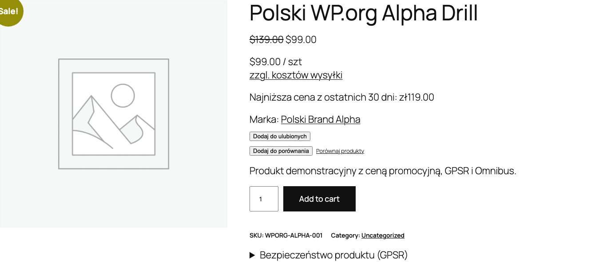

Smernica Omnibus (EU 2019/2161) platí v Poľsku od 1. januára 2023. Pri každom znížení ceny musíte zobraziť najnižšiu cenu za posledných 30 dní. Doplnok automaticky sleduje históriu cien a zobrazuje túto informáciu pri akciách.

## Ako funguje sledovanie cien

Doplnok ukladá každú zmenu ceny produktu (vrátane variantov) do databázy. Keď je produkt "v akcii", doplnok vypočíta najnižšiu cenu za 30 dní a zobrazí ju zákazníkom.

Sledovanie sa začína po zapnutí modulu. Ak produkt ešte nemá históriu cien, zobrazí sa náhradná správa.



## Konfigurácia

Prejdite do **WooCommerce > Nastavenia > Polski > Omnibus** a nakonfigurujte dostupné možnosti.

### Obdobie sledovania

| Možnosť | Popis | Predvolená hodnota |
|-------|------|------------------|
| `days` | Počet dní spätne na výpočet najnižšej ceny | `30` |
| `prune_after_days` | Po koľkých dňoch odstraňovať staré záznamy z histórie | `90` |

`prune_after_days` kontroluje veľkosť tabuľky v databáze. Hodnota `90` znamená, že údaje staršie ako 90 dní sa automaticky odstraňujú.

### Dane

| Možnosť | Popis | Predvolená hodnota |
|-------|------|------------------|
| `include_tax` | Či má zobrazovaná cena Omnibus obsahovať DPH | `true` |

Nastavte v súlade s nastaveniami cien vo WooCommerce. Ak sú ceny v obchode s DPH, ponechajte `true`.

### Miesta zobrazenia

| Možnosť | Popis | Predvolená hodnota |
|-------|------|------------------|
| `display_on_sale_only` | Zobrazovať iba pri produktoch v akcii | `true` |
| `show_on_single` | Stránka jednotlivého produktu | `true` |
| `show_on_loop` | Zoznam produktov (kategória, obchod) | `false` |
| `show_on_related` | Súvisiace produkty | `false` |
| `show_on_cart` | Košík | `false` |

Zapnite aspoň na stránke produktu (`show_on_single`). V zozname produktov (`show_on_loop`) zaberá viac miesta, ale niektoré výklady predpisov to vyžadujú.

### Bežná cena

| Možnosť | Popis | Predvolená hodnota |
|-------|------|------------------|
| `show_regular_price` | Zobrazovať aj bežnú cenu vedľa ceny Omnibus | `false` |

### Šablóna textu

| Možnosť | Popis | Predvolená hodnota |
|-------|------|------------------|
| `display_text` | Šablóna zobrazovanej správy | `Najniższa cena z {days} dni przed obniżką: {price}` |
| `no_history_text` | Text, keď nie je história cien | `Brak danych o wcześniejszej cenie` |

Dostupné premenné v šablóne `display_text`:

- `{price}` - najnižšia cena za dané obdobie
- `{days}` - počet dní (predvolene 30)
- `{date}` - dátum najnižšej ceny
- `{regular_price}` - bežná cena produktu (pred akciou)

#### Príklady šablón

```
Najniższa cena z {days} dni przed obniżką: {price}
```

```
Najniższa cena z ostatnich {days} dni: {price} (cena regularna: {regular_price})
```

```
Omnibus: {price} (z dnia {date})
```

### Spôsob výpočtu ceny

| Možnosť | Popis | Predvolená hodnota |
|-------|------|------------------|
| `price_count_from` | Odkedy počítať 30 dní | `sale_start` |

Dostupné hodnoty:

- `sale_start` - od dátumu začiatku akcie (odporúčané úradom UOKiK)
- `current_date` - od aktuálneho dátumu

### Variantné produkty

| Možnosť | Popis | Predvolená hodnota |
|-------|------|------------------|
| `variable_tracking` | Spôsob sledovania variantov | `per_variation` |

Dostupné hodnoty:

- `per_variation` - samostatné sledovanie každého variantu (odporúčané)
- `parent_only` - sledovanie iba ceny nadradeného produktu

`per_variation` poskytuje presnejšie údaje, lebo každý variant môže mať inú cenu a históriu zliav.

## Shortcode

Použite shortcode `[polski_omnibus_price]` na zobrazenie informácie o najnižšej cene na ľubovoľnom mieste webu.

### Základné použitie

```
[polski_omnibus_price]
```

Zobrazuje cenu Omnibus pre aktuálny produkt.

### S parametrami

```
[polski_omnibus_price product_id="456" days="30"]
```

### Parametre shortcode

| Parameter | Popis | Predvolená hodnota |
|----------|------|------------------|
| `product_id` | ID produktu | Aktuálny produkt |
| `days` | Počet dní | Hodnota z nastavení |

### Príklad použitia v PHP šablóne

```php
echo do_shortcode('[polski_omnibus_price product_id="' . $product_id . '"]');
```

## Automatické čistenie histórie

WP-Cron denne odstraňuje záznamy histórie cien staršie ako `prune_after_days`. Tabuľka v databáze nerastie bez obmedzení.

Na manuálne vynútenie čistenia môžete použiť WP-CLI:

```bash
wp cron event run polski_omnibus_prune
```

## Súlad s predpismi UOKiK

Usmernenia úradu UOKiK:

1. Informácia o najnižšej cene sa musí zobrazovať **pri každom oznámení o znížení**
2. Referenčné obdobie je **30 dní pred uplatnením zníženia**
3. Pre produkty predávané kratšie ako 30 dní - uveďte najnižšiu cenu od dňa uvedenia do predaja
4. Pre produkty rýchlo podliehajúce skaze - možné skrátenie obdobia

Doplnok predvolene uplatňuje tieto usmernenia. Možnosť `price_count_from` na `sale_start` počíta od dátumu začiatku akcie, v súlade s odporúčaniami UOKiK.

## Riešenie problémov

**Cena Omnibus sa nezobrazuje**
Skontrolujte, či má produkt nastavenú akciovú cenu vo WooCommerce. Pri zapnutej možnosti `display_on_sale_only` sa správa zobrazí iba pri aktívnej akcii.

**Zobrazuje sa správa o chýbajúcej histórii**
Sledovanie cien sa začína po zapnutí modulu. Počkajte na zmenu ceny alebo uložte produkt znova, aby ste pridali prvý záznam do histórie.

**Cena Omnibus je rovnaká ako akciová cena**
To je správne správanie, ak produkt nemal nižšiu cenu počas posledných 30 dní.

## Ďalšie kroky

- Nahlasujte problémy: [GitHub Issues](https://github.com/wppoland/polski/issues)
- Diskusie a otázky: [GitHub Discussions](https://github.com/wppoland/polski/discussions)

<div class="disclaimer">Táto stránka má výlučne informačný charakter a nepredstavuje právne poradenstvo. Pred nasadením sa poraďte s právnikom. Polski for WooCommerce je open source softvér (GPLv2) poskytovaný bez záruky.</div>
