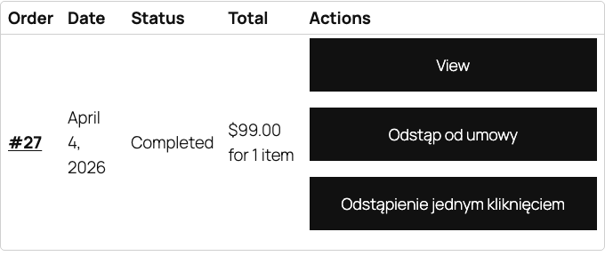

Директива ЄС 2023/2673 вводить нові обов'язки щодо права на відмову від договору (з 19 червня 2026). Плагін обробляє весь процес - форма клієнта, підтвердження e-mail, виключення продуктів та хуки для розробників.

## Правові вимоги

Споживач може відмовитися від дистанційного договору протягом 14 днів без причини. Як продавець ви повинні:

1. Поінформувати споживача про право на відмову перед укладенням договору
2. Надати форму відмови
3. Підтвердити отримання заяви про відмову
4. Повернути оплату протягом 14 днів від отримання заяви

Директива 2023/2673 додає вимогу цифрового процесу подання заяв та автоматичних підтверджень.

## Процес клієнта

### Крок 1 - кнопка в Мій обліковий запис

Після увімкнення модуля в **Мій обліковий запис > Замовлення** з'являється кнопка "Відмовитися від договору" при замовленнях для повернення. Кнопка видима 14 днів від доставки.



### Крок 2 - форма відмови

Після натискання кнопки клієнт переходить до форми, яка містить:

- Номер замовлення (заповнений автоматично)
- Дату замовлення
- Список продуктів із замовлення (з можливістю вибору, від яких відмовляється)
- Причину відмови (необов'язково)
- Контактні дані клієнта
- Номер банківського рахунку для повернення

### Крок 3 - підтвердження e-mail

Після подання форми система автоматично:

1. Надсилає клієнту e-mail з підтвердженням отримання заяви
2. Надсилає адміністратору магазину повідомлення про нове звернення
3. Змінює статус звернення на "Очікує"

Далі обробіть звернення в панелі WooCommerce та позначте як завершене.

## Виключення продуктів

Деякі продукти не підлягають праву на відмову. Позначте їх як виключені у вкладці **Polski - Відмова** в редакції продукту.

Типові виключення відповідно до ст. 38 закону про права споживачів:

- Продукти, виготовлені на замовлення або персоналізовані
- Продукти, що швидко псуються
- Запечатані продукти з гігієнічних міркувань (після відкриття)
- Аудіо/відео записи у запечатаній упаковці (після відкриття)
- Цифровий контент, наданий онлайн (після початку надання)
- Преса (щоденні видання, періодика, журнали)

При виключеному продукті кнопка "Відмовитися від договору" не з'являється в панелі клієнта.

## Шорткод

Використовуйте шорткод `[polski_withdrawal_form]` для відображення форми відмови в будь-якому місці сайту.

### Базове використання

```
[polski_withdrawal_form]
```

Відображає форму для авторизованого клієнта. Клієнт повинен обрати замовлення зі списку.

### Із зазначенням замовлення

```
[polski_withdrawal_form order_id="789"]
```

Відображає форму з даними замовлення з вказаним ID. Плагін перевіряє, чи авторизований користувач є власником замовлення.

### Приклад розміщення на сторінці

Створіть спеціальну сторінку "Форма відмови від договору" та розмістіть на ній шорткод:

```
[polski_withdrawal_form]
```

У налаштуваннях (**WooCommerce > Налаштування > Polski > Відмова**) вкажіть цю сторінку як сторінку форми за замовчуванням.

## Хуки

### polski/withdrawal/requested

Викликається, коли клієнт подає форму відмови.

```php
/**
 * @param int   $withdrawal_id ID звернення про відмову.
 * @param int   $order_id      ID замовлення WooCommerce.
 * @param array $form_data     Дані з форми.
 */
add_action('polski/withdrawal/requested', function (int $withdrawal_id, int $order_id, array $form_data): void {
    // Приклад: надіслати повідомлення до зовнішньої CRM-системи
    $crm_api = new MyCrmApi();
    $crm_api->notify_withdrawal($order_id, $form_data['reason']);
}, 10, 3);
```

### polski/withdrawal/confirmed

Викликається, коли адміністратор підтвердить отримання звернення.

```php
/**
 * @param int $withdrawal_id ID звернення про відмову.
 * @param int $order_id      ID замовлення WooCommerce.
 */
add_action('polski/withdrawal/confirmed', function (int $withdrawal_id, int $order_id): void {
    // Приклад: змінити статус замовлення
    $order = wc_get_order($order_id);
    if ($order) {
        $order->update_status('withdrawal-confirmed', 'Odstąpienie potwierdzone.');
    }
}, 10, 2);
```

### polski/withdrawal/completed

Викликається, коли весь процес відмови завершено (повернення оброблено).

```php
/**
 * @param int   $withdrawal_id ID звернення про відмову.
 * @param int   $order_id      ID замовлення WooCommerce.
 * @param float $refund_amount Сума повернення.
 */
add_action('polski/withdrawal/completed', function (int $withdrawal_id, int $order_id, float $refund_amount): void {
    // Приклад: зареєструвати повернення в бухгалтерській системі
    do_action('my_accounting/register_refund', $order_id, $refund_amount);
}, 10, 3);
```

### polski/withdrawal/eligible

Фільтр, що дозволяє програмно визначити, чи замовлення кваліфікується для відмови.

```php
/**
 * @param bool     $is_eligible Чи замовлення кваліфікується для відмови.
 * @param WC_Order $order       Об'єкт замовлення WooCommerce.
 * @return bool
 */
add_filter('polski/withdrawal/eligible', function (bool $is_eligible, WC_Order $order): bool {
    // Приклад: виключити замовлення з категорії "послуги"
    foreach ($order->get_items() as $item) {
        $product = $item->get_product();
        if ($product && has_term('uslugi', 'product_cat', $product->get_id())) {
            return false;
        }
    }
    return $is_eligible;
}, 10, 2);
```

### polski/withdrawal/period_days

Фільтр, що дозволяє змінити період відмови (за замовчуванням 14 днів).

```php
/**
 * @param int      $days  Кількість днів на відмову.
 * @param WC_Order $order Об'єкт замовлення WooCommerce.
 * @return int
 */
add_filter('polski/withdrawal/period_days', function (int $days, WC_Order $order): int {
    // Приклад: подовжити період до 30 днів у святковий сезон
    $order_date = $order->get_date_created();
    if ($order_date) {
        $month = (int) $order_date->format('m');
        if ($month === 12) {
            return 30;
        }
    }
    return $days;
}, 10, 2);
```

### polski/withdrawal/form_fields

Фільтр, що дозволяє модифікувати поля форми відмови.

```php
/**
 * @param array $fields Масив полів форми.
 * @return array
 */
add_filter('polski/withdrawal/form_fields', function (array $fields): array {
    // Приклад: додати поле для бажаного способу повернення
    $fields['refund_method'] = [
        'type'     => 'select',
        'label'    => 'Preferowany sposób zwrotu',
        'required' => true,
        'options'  => [
            'bank_transfer' => 'Przelew bankowy',
            'original'      => 'Tym samym sposobem płatności',
        ],
    ];
    return $fields;
}, 10, 1);
```

## Адміністрування звернень

Звернення про відмову доступні в панелі WooCommerce під **WooCommerce > Відмови**. Кожне звернення містить:

- Номер замовлення та посилання на замовлення
- Дату подання форми
- Статус (очікує, підтверджено, завершено, відхилено)
- Дані клієнта
- Список продуктів, що охоплені відмовою
- Причину (якщо вказано)

Можете змінити статус, додати нотатку або обробити повернення безпосередньо з панелі.

## Вирішення проблем

**Кнопка "Відмовитися від договору" не відображається**
Перевірте, чи: (1) модуль увімкнений, (2) замовлення має статус "Виконано", (3) не минув період відмови, (4) жоден продукт у замовленні не є виключеним.

**Клієнт не отримує підтверджувальний e-mail**
Перевірте налаштування e-mail WooCommerce у **WooCommerce > Налаштування > E-mail** та переконайтеся, що шаблон "Підтвердження відмови" увімкнений.

## Подальші кроки

- Повідомлення про проблеми: [GitHub Issues](https://github.com/wppoland/polski/issues)
- Обговорення та запитання: [GitHub Discussions](https://github.com/wppoland/polski/discussions)

<div class="disclaimer">Ця сторінка має виключно інформаційний характер і не є юридичною консультацією. Перед впровадженням зверніться до юриста. Polski for WooCommerce - це програмне забезпечення з відкритим кодом (GPLv2), що надається без гарантій.</div>
