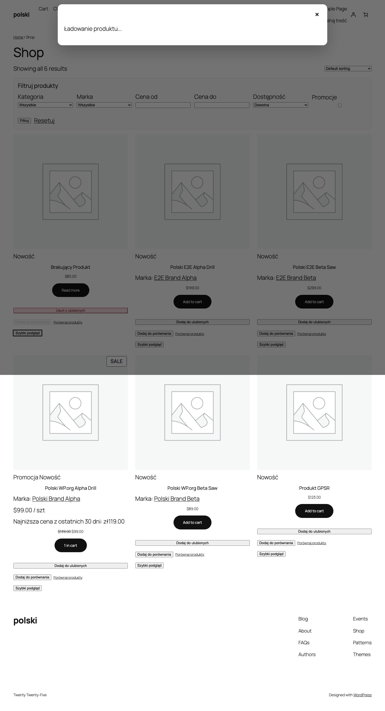

AJAX-фільтри дозволяють клієнтам звужувати список продуктів без перезавантаження сторінки. Фільтрація відбувається миттєво - продукти оновлюються в реальному часі після вибору критеріїв.

## Увімкнення модуля

Перейдіть до **WooCommerce > Polski > Модулі магазину** та активуйте опцію **AJAX-фільтри**. Модуль надасть фільтри як блок Gutenberg, shortcode та віджет.



## Доступні типи фільтрів

### Категорії

Ієрархічний фільтр з деревом категорій, що розгортається. Кількість продуктів відображається поряд з кожною категорією. Порожні категорії приховані за замовчуванням.

Опції:
- Відображення як дерево або плоский список
- Множинний вибір (чекбокси) або одиничний (radio)
- Згортання/розгортання підкатегорій

### Бренди (виробники)

Фільтр за виробником/брендом. Вимагає активного модуля **Виробник** у Polski for WooCommerce. Відображає список брендів з кількістю продуктів.

### Ціна

Повзунок діапазону цін (range slider) з полями min/max. Діапазон автоматично підлаштовується під продукти, що зараз відображаються.

Опції:
- Повзунок (slider)
- Текстові поля min/max
- Цінові діапазони (наприклад, 0-50 zl, 50-100 zl, 100+ zl)

Налаштування цінових діапазонів:

```php
add_filter('polski/ajax_filters/price_ranges', function (): array {
    return [
        ['min' => 0, 'max' => 50, 'label' => 'Do 50 zł'],
        ['min' => 50, 'max' => 100, 'label' => '50 - 100 zł'],
        ['min' => 100, 'max' => 200, 'label' => '100 - 200 zł'],
        ['min' => 200, 'max' => 0, 'label' => 'Powyżej 200 zł'],
    ];
});
```

### Наявність на складі

Фільтр, що дозволяє показати лише продукти, доступні на складі. Опції:

- **На складі** - продукти з `stock_status = instock`
- **На замовлення** - продукти з `stock_status = onbackorder`
- **Недоступні** - продукти з `stock_status = outofstock` (приховані за замовчуванням)

### Розпродаж

Чекбокс **Тільки продукти зі знижкою** - фільтрує лише продукти з активною акційною ціною.

### Атрибути продуктів

Динамічні фільтри, що генеруються автоматично на основі атрибутів WooCommerce (колір, розмір, матеріал тощо). Кожен глобальний атрибут може бути використаний як фільтр.

Типи відображення атрибутів:
- **Список чекбоксів** - за замовчуванням
- **Swatch кольорів** - для атрибуту з налаштованими кольорами
- **Кнопки** - компактний вибір (наприклад, розміри S, M, L, XL)
- **Dropdown** - випадаючий список

## Робота через AJAX

Після зміни будь-якого фільтра:

1. Надсилається AJAX-запит з обраними параметрами
2. Відображається деліктний spinner/skeleton на списку продуктів
3. Список продуктів оновлюється без перезавантаження сторінки
4. Лічильники продуктів у фільтрах оновлюються
5. Недоступні опції фільтрів стають сірими (але не приховуються)
6. URL у браузері оновлюється з GET-параметрами (History API)

## Fallback GET (без JavaScript)

Модуль підтримує режим fallback без JavaScript. Коли JS вимкнений або недоступний:

- Фільтри працюють як стандартна HTML-форма з GET-параметрами
- Після підтвердження сторінка перезавантажується з відфільтрованим списком продуктів
- Параметри фільтрів зберігаються в URL, наприклад: `?pa_color=red&min_price=50&max_price=200`
- Відфільтровані URL є SEO-friendly та можуть індексуватися пошуковими системами

Режим fallback працює автоматично - не потребує додаткового налаштування.

## Блок Gutenberg

Блок **Polski - AJAX-фільтри** доступний у редакторі Gutenberg. Розмістіть його у бічній панелі (sidebar) сторінки магазину.

Опції блоку:

- **Типи фільтрів** - вибір, які фільтри відображати
- **Порядок фільтрів** - сортування drag & drop
- **Стиль** - компактний, розгорнутий, акордеон
- **Кнопка скидання** - показати/сховати кнопку "Очистити фільтри"
- **Лічильники** - показати/сховати кількість продуктів біля кожної опції
- **Згортання** - за замовчуванням згорнуті/розгорнуті секції

## Shortcode `[polski_ajax_filters]`

### Параметри

| Параметр     | Тип    | За замовчуванням | Опис                                          |
| ------------ | ------ | ---------------- | --------------------------------------------- |
| `filters`    | string | `all`            | Типи фільтрів (через кому)                    |
| `style`      | string | `expanded`       | Стиль: `expanded`, `compact`, `accordion`      |
| `show_count` | string | `yes`            | Показати лічильники продуктів                  |
| `show_reset` | string | `yes`            | Показати кнопку скидання                       |
| `columns`    | int    | `1`              | Кількість колонок фільтрів                     |
| `ajax`       | string | `yes`            | Режим AJAX (no = тільки GET)                   |

### Приклад використання

```html
[polski_ajax_filters filters="category,price,pa_color,stock" style="accordion" show_count="yes"]
```

### Фільтрація тільки за атрибутами

```html
[polski_ajax_filters filters="pa_color,pa_size,pa_material" style="compact"]
```

### Розміщення у sidebar теми

У файлі `sidebar.php` або у віджетах:

```php
echo do_shortcode('[polski_ajax_filters filters="category,price,stock,sale"]');
```

## Інтеграція з пагінацією

AJAX-фільтри працюють разом з пагінацією WooCommerce. Після зміни фільтра користувач повертається на сторінку 1 результатів. Пагінація також працює в AJAX-режимі - перехід між сторінками не скидає обрані фільтри.

## Активні фільтри

Над списком продуктів відображаються активні фільтри у формі тегів (chips). Кожен тег має кнопку X для видалення окремого фільтра. Кнопка **Очистити всі** скидає всі фільтри одночасно.

```php
// Зміна позиції панелі активних фільтрів
add_filter('polski/ajax_filters/active_position', function (): string {
    return 'above_products'; // або 'below_filters', 'both'
});
```

## Продуктивність

Запити фільтрів використовують індекси бази даних WooCommerce (`product_meta_lookup`). Для магазинів з великою кількістю продуктів (10 000+) рекомендується використання object cache (Redis/Memcached).

Результати фільтрації кешуються у transient API з ключем на основі хешу параметрів фільтра. Кеш очищується при зміні ціни, наявності на складі або атрибутів продукту.

## Стилізація CSS

- `.polski-ajax-filters` - контейнер фільтрів
- `.polski-ajax-filters__section` - секція окремого фільтра
- `.polski-ajax-filters__title` - заголовок секції
- `.polski-ajax-filters__option` - опція фільтра (checkbox/radio)
- `.polski-ajax-filters__count` - лічильник продуктів
- `.polski-ajax-filters__reset` - кнопка скидання
- `.polski-ajax-filters__active` - панель активних фільтрів

## Вирішення проблем

**Фільтри не оновлюють список продуктів** - переконайтеся, що CSS-селектор списку продуктів правильний. За замовчуванням модуль шукає `.products` або `ul.products`. Власні теми можуть використовувати інший селектор.

**Лічильники показують 0** - перевірте, чи продукти мають призначені атрибути, категорії та статус наявності. Порожній атрибут не буде враховуватися.

**Повзунок ціни не працює** - перевірте, чи на сторінці немає конфлікту з jQuery UI з іншого плагіна.

Повідомлення про проблеми: [github.com/wppoland/polski/issues](https://github.com/wppoland/polski/issues)

<div class="disclaimer">Ця сторінка має виключно інформаційний характер і не є юридичною консультацією. Перед впровадженням зверніться до юриста. Polski for WooCommerce - це програмне забезпечення з відкритим кодом (GPLv2), що надається без гарантій.</div>
