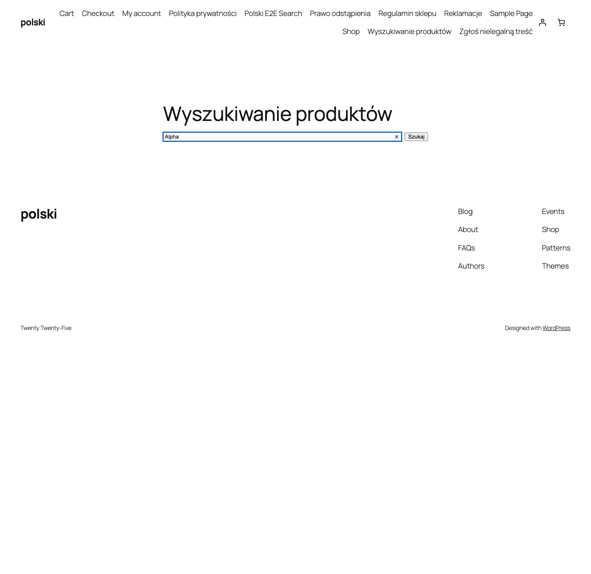

AJAX-пошук замінює стандартний пошук WooCommerce інтелектуальним пошуком з підказками в реальному часі. Результати з'являються миттєво під час введення фрази - без перезавантаження сторінки.

## Увімкнення модуля

Перейдіть до **WooCommerce > Polski > Модулі магазину** та активуйте опцію **AJAX-пошук**. Модуль автоматично замінить стандартний віджет пошуку WooCommerce.



## Поля для пошуку

Пошук здійснюється одночасно за багатьма полями продукту:

### SKU (каталожний номер)

Клієнт може ввести номер SKU продукту або його частину. Пошук за SKU особливо корисний у B2B-магазинах, де клієнти замовляють продукти за каталожними номерами.

### Виробник (manufacturer)

Якщо модуль **Виробник** активний, пошук враховує назву виробника у результатах. Введення, наприклад, "Samsung" покаже всі продукти цього виробника.

### GTIN (EAN/UPC)

Пошук за штрих-кодами GTIN/EAN/UPC. Клієнт може ввести повний штрих-код або його частину, щоб знайти продукт.

### Додаткові поля

- Назва продукту
- Короткий опис
- Категорії
- Теги
- Атрибути (колір, розмір тощо)

Налаштування полів для пошуку: **WooCommerce > Polski > Модулі магазину > AJAX-пошук > Поля пошуку**.

## Результати пошуку

Dropdown з результатами відображає:

- Мініатюру продукту
- Назву продукту (з підсвічуванням фрагментів, що збігаються)
- Ціну
- Категорію
- Оцінку (зірочки)
- Статус наявності

За замовчуванням відображається до **8 підказок**. Ліміт можна змінити:

```php
add_filter('polski/ajax_search/results_limit', function (): int {
    return 12;
});
```

Мінімальна кількість символів для початку пошуку - **3**. Зміна:

```php
add_filter('polski/ajax_search/min_chars', function (): int {
    return 2;
});
```

## REST API endpoint

Пошук використовує власний REST API endpoint замість `admin-ajax.php`, що забезпечує кращу продуктивність.

**Endpoint:** `GET /wp-json/polski/v1/search`

**Параметри:**

| Параметр | Тип    | Обов'язковий | Опис                          |
| -------- | ------ | ------------ | ----------------------------- |
| `q`      | string | Так          | Фраза пошуку                  |
| `limit`  | int    | Ні           | Ліміт результатів (за замовчуванням 8) |
| `cat`    | int    | Ні           | ID категорії для фільтрації   |

**Приклад запиту:**

```bash
curl "https://twojsklep.pl/wp-json/polski/v1/search?q=koszulka&limit=5"
```

**Приклад відповіді:**

```json
{
  "results": [
    {
      "id": 123,
      "title": "Koszulka bawełniana",
      "url": "https://twojsklep.pl/produkt/koszulka-bawelniana/",
      "image": "https://twojsklep.pl/wp-content/uploads/koszulka.jpg",
      "price_html": "<span class=\"amount\">49,00&nbsp;zł</span>",
      "category": "Odzież",
      "in_stock": true,
      "rating": 4.5
    }
  ],
  "total": 1,
  "query": "koszulka"
}
```

## Блок Gutenberg

Модуль надає блок **Polski - AJAX-пошук** у редакторі Gutenberg. Блок можна розмістити у будь-якому пості, сторінці або віджеті.

Опції блоку:

- **Placeholder** - текст-заповнювач у полі пошуку
- **Ширина** - ширина поля (auto, повна, власна в px)
- **Іконка** - показати/сховати іконку лупи
- **Фільтр категорій** - показати dropdown фільтрації за категорією поряд з полем пошуку
- **Стиль** - заокруглені кути, обрамлення, тінь

Вставлення блоку: у редакторі Gutenberg натисніть **+** та знайдіть **Polski** або **AJAX-пошук**.

## Віджет Elementor

Для користувачів Elementor доступний спеціалізований віджет **Polski AJAX Search**. Віджет знаходиться у категорії **Polski for WooCommerce** у бічній панелі Elementor.

Опції віджета включають усі налаштування блоку Gutenberg та додаткові:

- Контроль типографіки (сімейство шрифту, розмір, насиченість)
- Кольори (фон, текст, обрамлення, hover)
- Відступи та padding-и
- Анімація появи результатів
- Адаптивність (налаштування для кожного breakpoint)

## Shortcode `[polski_ajax_search]`

### Параметри

| Параметр      | Тип    | За замовчуванням    | Опис                               |
| ------------- | ------ | ------------------- | ---------------------------------- |
| `placeholder` | string | `Szukaj produktów…` | Текст-заповнювач                    |
| `width`       | string | `100%`              | Ширина поля                         |
| `show_icon`   | string | `yes`               | Відобразити іконку лупи             |
| `show_cat`    | string | `no`                | Відобразити фільтр категорій        |
| `limit`       | int    | `8`                 | Максимальна кількість підказок      |

### Приклад використання

```html
[polski_ajax_search placeholder="Czego szukasz?" show_cat="yes" limit="10"]
```

### Вставлення у заголовок теми

```php
// У functions.php теми
add_action('wp_body_open', function (): void {
    echo do_shortcode('[polski_ajax_search placeholder="Szukaj..." width="400px"]');
});
```

## Debouncing та продуктивність

Пошук застосовує debouncing 300 мс - запит до сервера надсилається лише через 300 мс після останнього натискання клавіші. Це запобігає надмірній кількості запитів під час швидкого введення.

Результати кешуються на стороні клієнта у сесії браузера. Повторне введення тієї ж фрази не генерує запит до сервера.

На стороні сервера результати кешуються у transient API WordPress (за замовчуванням 1 година). Кеш автоматично очищується після збереження, додавання або видалення продукту.

```php
// Зміна часу кешу
add_filter('polski/ajax_search/cache_ttl', function (): int {
    return 1800; // 30 хвилин у секундах
});
```

## Стилізація CSS

CSS-класи модуля:

- `.polski-ajax-search` - контейнер пошуку
- `.polski-ajax-search__input` - текстове поле
- `.polski-ajax-search__results` - dropdown з результатами
- `.polski-ajax-search__item` - окремий результат
- `.polski-ajax-search__item--active` - підсвічений результат (клавіатурна навігація)
- `.polski-ajax-search__highlight` - підсвічування фрагмента, що збігається
- `.polski-ajax-search__loading` - spinner завантаження

## Доступність

Пошук підтримує повну клавіатурну навігацію:

- **Стрілка вниз/вгору** - навігація по результатах
- **Enter** - перехід до обраного продукту
- **Escape** - закриття dropdown
- ARIA-атрибути: `role="combobox"`, `aria-expanded`, `aria-activedescendant`

Повідомлення про проблеми: [github.com/wppoland/polski/issues](https://github.com/wppoland/polski/issues)

<div class="disclaimer">Ця сторінка має виключно інформаційний характер і не є юридичною консультацією. Перед впровадженням зверніться до юриста. Polski for WooCommerce - це програмне забезпечення з відкритим кодом (GPLv2), що надається без гарантій.</div>
