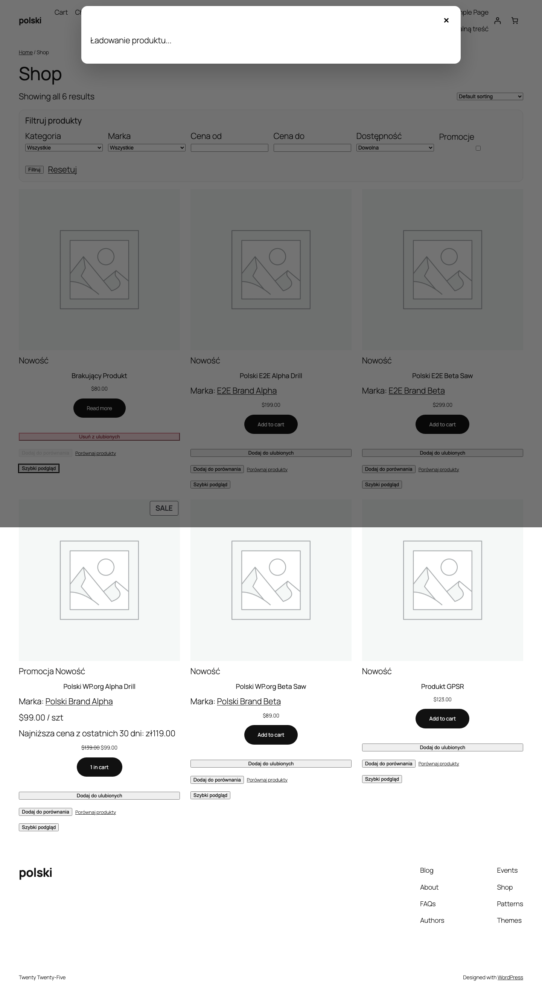

Порівняння дозволяє клієнтам зіставити кілька товарів поруч у таблиці характеристик. Це полегшує вибір, особливо в магазинах із великим асортиментом.



## Увімкнення модуля

Перейдіть до **WooCommerce > Polski > Магазинні модулі** та увімкніть **Порівняння товарів**. На товарах з'явиться кнопка порівняння.

## Таблиця характеристик (feature table)

Клієнт бачить таблицю зі стовпцем для кожного товару. Рядки містять:

- Фото товару
- Назву з посиланням
- Ціну (з урахуванням акцій та директиви Omnibus)
- Оцінку (зірочки)
- Короткий опис
- Статус наявності
- Атрибути товару (колір, розмір тощо)
- Час доставки (якщо встановлено)
- Кнопку **Додати до кошика**

Рядки з однаковими значеннями можна автоматично приховати, увімкніть **Приховати однакові характеристики** в налаштуваннях. Клієнт побачить лише відмінності між товарами.

## Максимальна кількість товарів

За замовчуванням клієнт може порівняти до **4 товарів** одночасно. Змініть ліміт у налаштуваннях або фільтром:

```php
add_filter('polski/compare/max_items', function (): int {
    return 6;
});
```

Після досягнення ліміту кнопка **Додати до порівняння** стає неактивною. Клієнт спочатку має видалити один із товарів.

## Автоматична заміна (auto-replace)

Коли **Автоматична заміна** увімкнена, новий товар понад ліміт замінює найстаріший. Клієнт бачить toast-сповіщення про заміну.

Увімкнення в налаштуваннях: **WooCommerce > Polski > Магазинні модулі > Порівняння > Автоматична заміна**.

Або програмно:

```php
add_filter('polski/compare/auto_replace', '__return_true');
```

## Робота через AJAX

Порівняння працює без перезавантаження сторінки. Доступні AJAX-дії:

| Дія                          | Опис                           |
| ---------------------------- | ------------------------------ |
| `polski_compare_add`         | Додавання товару               |
| `polski_compare_remove`      | Видалення товару               |
| `polski_compare_get`         | Отримання списку товарів       |
| `polski_compare_clear`       | Очищення порівняння            |

Дані зберігаються в сесії WooCommerce (`WC()->session`). Працюють для гостей та авторизованих клієнтів.

## Шорткод `[polski_compare]`

Відображає таблицю порівняння в будь-якому місці магазину.

### Параметри

| Параметр        | Тип    | За замовчуванням | Опис                                          |
| --------------- | ------ | --------- | --------------------------------------------- |
| `columns`       | string | `all`     | Характеристики для відображення (через кому)  |
| `hide_similar`  | string | `no`      | Приховати рядки з однаковими значеннями       |
| `show_remove`   | string | `yes`     | Показати кнопку видалення товару              |

### Приклад використання

```html
[polski_compare columns="image,name,price,rating,stock" hide_similar="yes"]
```

### Використання на окремій сторінці

Створіть сторінку, наприклад **Порівняння товарів**, та вставте шорткод:

```html
[polski_compare]
```

У налаштуваннях модуля вкажіть цю сторінку як **Сторінка порівняння**. Кнопка **Переглянути порівняння** перенаправить на неї.

## Кнопка порівняння

Кнопка видима на картці товару та на сторінці товару. Змініть позицію фільтром:

```php
add_filter('polski/compare/button_position', function (): string {
    return 'after_add_to_cart';
});
```

Доступні позиції: `before_add_to_cart`, `after_add_to_cart`, `after_summary`.

## Панель порівняння (floating bar)

Після додавання першого товару внизу екрана з'являється панель із мініатюрами та кнопкою **Порівняти**. На мобільних замість мініатюр відображається кількість обраних товарів.

## Порівняння в межах категорії

За замовчуванням можна порівнювати товари з різних категорій. Щоб обмежити однією категорією:

```php
add_filter('polski/compare/same_category_only', '__return_true');
```

Клієнт побачить повідомлення, якщо спробує додати товар з іншої категорії.

## Стилізація CSS

CSS-класи модуля:

- `.polski-compare-button`, кнопка додавання до порівняння
- `.polski-compare-button--active`, товар у порівнянні
- `.polski-compare-table`, таблиця порівняння
- `.polski-compare-bar`, панель внизу екрана
- `.polski-compare-empty`, повідомлення про порожнє порівняння

## Усунення проблем

**Таблиця не відображає атрибути**, перевірте, чи атрибути мають позначку **Видимі на сторінці товару** в редагуванні товару (вкладка Атрибути).

**Кнопка не реагує на клік**, перевірте консоль браузера. Часта причина, це дубльований jQuery або конфлікт із плагіном оптимізації JS.

Повідомлення про проблеми: [github.com/wppoland/polski/issues](https://github.com/wppoland/polski/issues)

<div class="disclaimer">Ця сторінка має виключно інформаційний характер і не є юридичною консультацією. Перед впровадженням проконсультуйтеся з юристом. Polski for WooCommerce, це програмне забезпечення з відкритим кодом (GPLv2), що надається без гарантій.</div>
